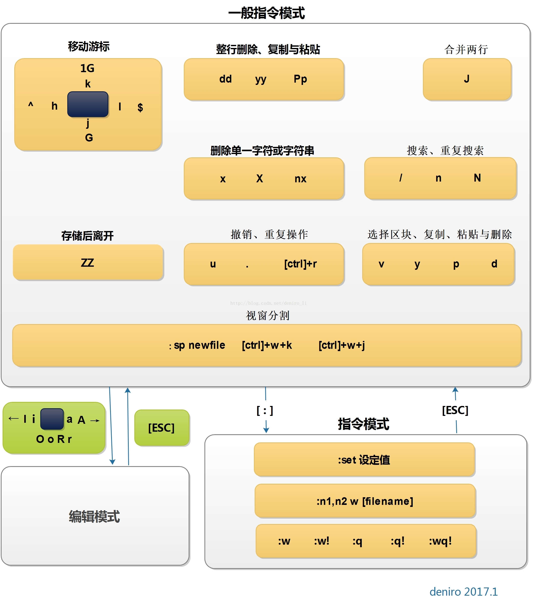

# Mac开发配置手册

《Mac开发配置手册》如何让一部全新的MacBook快速完成开发环境配置。


## 目录

* [Mac开发前需做的系统设置](#Mac开发前需做的系统设置)
* [必装软件清单](#必装软件清单)
* [brew](#brew)
* [iTerm2](#iTerm2)
  * [iTerm2常用快捷命令](#iTerm2常用快捷命令)
* [ohmyzsh](#ohmyzsh)
  * [编辑zshrc文件](#编辑zshrc文件)
  * [安装配色方案](#安装配色方案)
  * [安装代码高亮插件](#安装代码高亮插件)
  * [安装自动提示命令插件](#安装自动提示命令插件)
  * [给iTerm2中ls配色](#给iTerm2中ls配色)
  * [终端神器一键配置](#终端神器一键配置)
* [vim](#vim)
  * [进入vim界面](#进入vim界面)
  * [vim三种模式](#vim三种模式)
  * [一般模式快捷命令](#一般模式快捷命令)
  * [编辑模式快捷命令](#编辑模式快捷命令)
  * [命令行模式快捷命令](#命令行模式快捷命令)
  * [常用快捷命令命令示意图](#常用快捷命令命令示意图)
  * [其它命令](#其它命令)
  * [vim的警告信息](#vim的警告信息)
  * [vim环境设置与记录](#vim环境设置与记录)
* [git](#git)
* [Sudo免密码设置](#Sudo免密码设置)
* [临时上传下载文件](#临时上传下载文件)
* [About](#About)
* [License](#License)

## Mac开发前需做的系统设置

### 系统设置

在任何的操作系统中，首先你需要做一件事就是更新系统，点击窗口左上角的  > 关于本机 > 软件更新。
此外，如果这是一部新的电脑，你还需要到系统设置进行一些适当调整。如何调整，取决于个人喜好。

* 触控板(系统设置 > 触控板)
  * [ ] 光标与点击
  * [x] 轻拍来点按
  * [x] 辅助点按
  * [x] 查找
  * [x] 三指拖移
  * [ ] 滚动缩放
  * [x] 默认全选
  * [ ] 更多手势
  * [x] 默认全选
* Dock
  * 置于屏幕上的位置：底部
  * 设置Dock图标更小(大小随个人喜好)
  * ✓ 自动显示和隐藏Dock
* Finder
  * Finder > 显示
  * Finder > 偏好设置
    * 通用:开启新Finder窗口时打开:HOME「用户名」目录
    * 边栏:添加HOME用户名」目录和创建代码文件目录,将共享的(shared)和标记(tags)目录去掉
* 菜单栏
  * 去掉蓝牙等无需经常使用的图标
  * 将电池显示设置为百分比

* Spotlight
  * 去掉字体和书签与历史记录等不需要的内容
  * 设置合适的快捷键

* 互联网帐户
  * 添加iCloud用户，同步日历，联系人和 Find my mac 等等。
  

## 必装软件清单

### 开发工具

|软件|描述|使用|
|:-----|:-----|:-----|
|[brew](https://brew.sh/)| ||
|[iTerm2](https://iterm2.com/)| ||
|[ohmyzsh](https://ohmyz.sh/)| ||
|[git]| |`brew install git`|
|[redis]| |`brew install redis`|
|[nginx]| |`brew install nginx` 如果安装docker环境可不装|
|[sequelpro](http://sequelpro.com/)|数据库管理工具| |
|[SwitchHosts](https://github.com/oldj/SwitchHosts)|Hosts管理工具| |
|[Google Chrome](https://google.com/intl/en/chrome/)| |`brew cask install google-chrome`|
|[Sketch](https://www.sketch.com/)| ||
|[Dash](https://kapeli.com/dash)| ||
|[Parallels](https://www.parallels.com/hk)| |
|[Github](https://desktop.github.com/)| ||

### 生产力工具

|软件|描述|使用|
|:-----|:-----|:-----|
|[The Unarchiver](https://theunarchiver.com/)|支持多种格式(包括Windows下的格式)的压缩/解压缩工具||
|[1Password](https://blog.1password.com/accel-partnership/)|跨平台的密码管理工具||
|[Alfred 2](https://www.alfredapp.com/)|搜索工具||
|[AppCleaner](http://freemacsoft.net/appcleaner/)|应用程序卸载工具||
|[Dropbox](https://www.dropbox.com/)|文件同步工具||
|[Reeder](https://reederapp.com/)|RSS阅读工具||
|[Pocket](https://getpocket.com/)|稍后阅读工具||
|[Spectacle](https://www.spectacleapp.com/)|让窗口成比例的显示,在写代码调试的时候很方便||
|[OminiFocus](https://www.omnigroup.com/omnifocus)|时间管理工具||
|[Mou](http://25.io/mou/)|Markdown编辑器,国人出品||

### 其它工具

|软件|版本|说明|
|:-----|:-----|:-----|
|[CheatSheet](http://www.grandtotal.biz/cheatsheet/)|长按Command,将能查看当前程序的快捷键||


## brew

Homebrew:包管理工具可以让你安装和更新程序变得更方便，是目前在OS X系统中最受欢迎的包管理工具。
类似于centos下的yum，可以很方便地进行安装/卸载/更新各种软件包。

### 安装

`/usr/bin/ruby -e "$(curl -fsSL https://raw.githubusercontent.com/Homebrew/install/master/install)"`

#### 安装并更改源

在Mac上安装brew时，如果使用官方推荐的方式，会耗费很长时间，并且也不一定能成功。

将安装源换成国内源

* 将brew的install文件下载本地

  `curl -fsSL https://raw.githubusercontent.com/Homebrew/install/master/install >> brew_install`
  
* 修改install文件的镜像源

  `vim brew_install`
  
* 将brew_install文件里面的两行代码替换掉

  待替换的代码为：
  
  ```
  BREW_REPO = "https://github.com/Homebrew/brew".freeze
  CORE_TAP_REPO = "https://github.com/Homebrew/homebrew-core".freeze
  ```
  
  替换为：
  
  ```
  BREW_REPO = "git://mirrors.ustc.edu.cn/brew.git".freeze
  CORE_TAP_REPO = "git://mirrors.ustc.edu.cn/homebrew-core.git".freeze
  ```
  
  修改完成之后保存好修改后的brew_install文件。
  
* 安装

  `/usr/local/bin/ruby ~/brew_install`

### 基本使用

* `brew update`:更新Homebrew在服务器端上的包目录
* `brew install <package_name>`:安装
* `brew upgrade <package_name>`:更新
* `brew remove`:卸载
* `brew outdated`:查看你的包是否需要更新
* `brew cleanup`:Homebrew将会把老版本的包缓存下来，以便当你想回滚至旧版本时使用。但这是比较少使用的情况，当你想清理旧版本的包缓存时，可以运行。
* `brew list`:列出当前安装的软件
* `brew list --versions`:列出当前安装的软件(包括版本号)
* `brew search <package_name>`:查询与`package_name`相关的可用软件
* `brew info <package_name>`:查询`package_name`的安装信息

### Cask

你已经感受到了使用 Homebrew 安装命令行程序的便利。
那么接下来，我们将通过Homebrew Cask优雅、简单、快速的安装和管理OS X图形界面程序，比如Google Chrome和Dropbox。

安装Homebrew-cask是如此的简单直接，运行以下命令即可完成：

```
// 添加Github上的caskroom/cask库
brew tap caskroom/cask  
// 安装brew-cask
brew install brew-cask  
// 安装Google浏览器
brew cask install google-chrome 
// 更新
brew update && brew upgrade brew-cask && brew cleanup
```

如果你想查看cask上是否存在你需要的app，可以到[caskroom.io](https://buyinstagramlikes.io/caskroom/)进行搜索。

**文件预览插件**

有些插件可以让Mac上的文件预览更有效，比如语法高亮、markdown 渲染、json 预览等等。

```
brew cask install qlcolorcode
brew cask install qlstephen
brew cask install qlmarkdown
brew cask install quicklook-json
brew cask install qlprettypatch
brew cask install quicklook-csv
brew cask install betterzipql
brew cask install webp-quicklook
brew cask install suspicious-package  
```

OS X图形界面程序

```
brew cask install alfred
brew cask install appcleaner
brew cask install cheatsheet
brew cask install dropbox
brew cask install google-chrome
brew cask install onepassword
brew cask install sublime-text
brew cask install totalfinder
```

> 如果你经常使用Alfred启动程序，那么你会想Alfred可以搜索brew cask安装的程序，实现这些仅需运行：

```
brew cask alfred link
```

此外你还可以通过brew cask安装[launchrocket](https://github.com/jimbojsb/launchrocket)，来管理通过brew安装的service。


## iTerm2

作为一名开发者，我们常常花上很多时间在终端上，如同武士的剑，一出手便知高低。所以让我们安装Mac上最强大的终端iTerm2吧！

* 在`Keys -> Hotkey`中设置`command + option + i`快速显示和隐藏iTerm
* 在`Profiles -> Default -> Check silence bell`
* 下载`Solarized dark iterm colors`，在`Profiles -> Default -> Colors -> Load Presets`将其导入，作为默认颜色。
* 在`Profiles -> Text`改变游标(cursor)文字和颜色，随个人喜好。

### iTerm2常用快捷命令

|命令|说明|
|:-----|:-----|
|`command + t`|新建标签|
|`command + w`|关闭标签|
|`command + 数字` `command + 左右方向键`|切换标签|
|`command + d`|垂直分屏|
|`command + shift + d`|水平分屏|
|`command + shift + h`|查看剪贴板历史|
|`ctrl + u`|清除当前行|
|`ctrl + w`|删除光标之前的单词|
|`ctrl + k`|删除到文本末尾|


## ohmyzsh

安装zsh，zsh的功能极其强大，只是配置过于复杂,通过oh-my-zsh可以很快配置zsh。其中Env.sh文件用于维护别名(aliases)，输出(exports)和路径改变(path changes)等等，以免影响`~/.zshrc`。

使用brew完成zsh和zsh completions的安装:`brew install zsh zsh-completions`

> Mac系统默认使用dash作为终端，可以使用命令修改默认使用zsh:

```
chsh -s /bin/zsh
```

如果想修改回默认dash，同样使用chsh命令即可：

```
chsh -s /bin/bash
```

> 查看系统当前使用的shell:`echo $SHELL`

> 查看系统是否安装了zsh:`cat /etc/shells`

安装oh-my-zsh方法有两种，可以使用curl或wget，看自己环境或喜好：

```
# curl 安装方式
sh -c "$(curl -fsSL https://raw.github.com/robbyrussell/oh-my-zsh/master/tools/install.sh)"
```

```
# wget 安装方式
sh -c "$(wget https://raw.githubusercontent.com/robbyrussell/oh-my-zsh/master/tools/install.sh -O -)"
```

卸载oh-my-zsh，在命令行输入如下命令，回车即可:`uninstall_oh_my_zsh`

### 编辑zshrc文件

```
# 设置主题
ZSH_THEME="agnoster"

# 设置别名
alias zshconfig="vim ~/.zshrc"
alias envconfig="vim ~/.env"
alias ohmyzsh="vim ~/.oh-my-zsh"  

# 隐藏用户名和主机名(user@hostname)
prompt_context() {}
```

oh-my-zsh主题列表:https://github.com/robbyrussell/oh-my-zsh/wiki/themes

> 注意：许多主题需要安装[Powerline Fonts](https://github.com/powerline/fonts)才能正确呈现。

```
# clone
git clone https://github.com/powerline/fonts.git --depth=1
# install
cd fonts
./install.sh
# clean-up a bit
cd ..
rm -rf fonts
```

安装好字体库之后，我们来设置iTerm2的字体，具体的操作是:
打开`iTerm2 -> Preferences -> Profiles -> Text`,在Font区域选中`Change Font`，然后找到Meslo字体。有L、M、S可选，看个人喜好：

### 安装配色方案

```
cd ~/.oh-my-zsh/custom/plugins
git clone https://github.com/altercation/solarized
cd solarized/iterm2-colors-solarized/
open .
```

在打开的finder窗口中，双击`Solarized Dark.itermcolors`和`Solarized Light.itermcolors`即可安装明暗两种配色：

打开`iTerm2 -> Preferences -> Profiles -> Colors -> Color Presets`中根据个人喜好选择。

### 安装代码高亮插件

```
cd ~/.oh-my-zsh/custom/plugins
git clone https://github.com/zsh-users/zsh-syntax-highlighting.git
vim ~/.zshrc
```

这时我们再次打开zshrc文件进行编辑。找到plugins，此时plugins中应该已经有了git，我们需要把高亮插件也加上：

```
plugins=(git zsh-syntax-highlighting)
```

> 请务必保证插件顺序，`zsh-syntax-highlighting`必须在最后一个。

执行命令使刚才的修改生效:`source ~/.zshrc`

### 安装自动提示命令插件

跟代码高亮的安装方式一样，这也是一个zsh的插件，叫做`zsh-autosuggestion`，用于命令建议和补全。

```
cd ~/.oh-my-zsh/custom/plugins/
git clone https://github.com/zsh-users/zsh-autosuggestions
vim ~/.zshrc
```

同上找到plugins，把自动提示命令插件加上：

```
plugins=(git zsh-autosuggestions zsh-syntax-highlighting)
```

执行命令使刚才的修改生效:`source ~/.zshrc`

> 推荐一张背景图:`http://wx1.sinaimg.cn/large/81f8a509gy1fnjdvkkwgoj20zk0m8ak8.jpg`


### 终端神器一键配置


## vim

所有的 UNIX Like 系统度会内置vi文本编辑器，其他的文本编辑器则不一定会存在。

### 进入vim界面

* `vim filename` 打开或新建文件，并将光标置于第一行首
* `vim +n filename` 打开文件，并将光标置于第n行首
* `vim + filename` 打开文件，并将光标置于最后一行首
* `vim +/pattern filename` 打开文件，并将光标置于第一个与pattern匹配的串处
* `vim -r filename` 在上次正用vi编辑时发生系统崩溃，恢复filename
* `vim filename....filename` 打开多个文件，依次进行编辑

### vim三种模式

* 一般模式:以vim打开一个文件就直接进入一般模式(默认的模式)。可以上下移动光标，删除字符或删除整行，也可以复制、粘贴你的文件数据，但无法编辑文件内容。
* 编辑模式:按下`i,I,o,O,a，A,r,R`等任一个字母之后才会进入编辑模式，界面的左下方会出现`INSERT`或`REPLACE`的字样。再按下`Esc`按键即可退出编辑模式，回到一般模式。
* 命令行模式:输入`: / ?`3个中的任一个按钮，就可以将光标移动到最下面那一行。此模式中，可以提供你的查找数据的操作，而读取、保存大量替换字符、离开vim、显示行号等的操作则是在此模式中完成的。
 
### 一般模式快捷命令

* 光标移动

  * `h` 或 `←` 或 `Backspace` 光标左移一个字符
  * `l` 或 `→` 或 `space` 光标右移一个字符，向后面移动20个字符距离，可以使用`20`+`l`或`→`或`space`的组合按键。
  * `k` 或 `↑` 或 `Ctrl+p` 光标上移一行
  * `j` 或 `↓` 或 `Ctrl+n` 光标下移一行，向下移动30行，可以使用`30`+`j`或`↓`或`trl+n`的组合按键。
  * `Home` 或 `0` 移动到这一行的最前面字符处
  * `End` 或 `$` 移动到这一行的最后面字符处
  * `gg` 或 `H` 移动到这个文件的第一行，想要移动到这个文件的第20行，使用`20gg`组合按键
  * `G` 或 `L` 移动到这个文件的最后一行，想要移动到这个文件的第20行，可以`20G`组合按键。
  * `M` 移动到屏幕的中间行。
  * `n[Enter]` n为数字。光标向下移动n行。
  
* 搜索(查找)

  * `/abc` 从光标开始处向文件尾搜索abc
  * `?abc` 从光标开始处向文件首搜索abc
  * `/\/abc` 从光标开始处向文件尾搜索/abc，其中/是转义
  * `n` 向下继续查找上一次搜索的内容
  * `N` 向上继续查找上一次搜索的内容

* 替换

  命令：`:[range]s/from/to/[c,e,g,i]`
  * `[range]s` 指的是范围
    * 不写range,则默认为光标所在行
    * . 表示当前行
    * $ 表示最后一行
    * % 表示所有行
    * 5 表示第五行
    * 1,7 从第一行至第七行
    * .+1 表示当前行的下一行
    * $-1 表示倒数第二行
  * `pattern` 就是要被替换掉的字串，可以用 regexp 来表示
  * `string` 将 pattern 由 string 所取代
  * `[c,e,g,i]` 
    * 无:表示只替换范围内的第一个
    * c 替换前进行询问
    * e 忽略执行过程中的错误
    * g 对指定范围内的所有项进行替换
    * i 不分大小写

  > 例如：在100到200行之间查找abc并替换为ABC则用：`:100,200s/abc/ABC/g`。

  基本使用
  * `:s/abc/ABC/` 替换当前行第一个 abc 为 ABC。
  * `:s/abc/ABC/g` 替换当前行所有 abc 为 ABC。
  * `:n,$s/abc/ABC/` 替换第n行开始到最后一行中每一行的第一个abc为ABC。
  * `:n,$s/abc/ABC/g` 替换第n行开始到最后一行中每一行所有abc为ABC。
  * `:%s/abc/ABC/` 替换每一行的第一个abc为ABC。
  * `:%s/abc/ABC/g` 替换每一行中所有abc为ABC。
  
  > 可以使用`#`或`+`作为分隔符，此时出现的`/`不会作为分隔符。如:`:s#abc/#ABC/#`替换当前行第一个`abc/`为`ABC/`。
  
* 删除

  * `x` 在一行字当中，向后删除一个字符(相当于[Del]按键)。
  * `X` 在一行字当中，向前删除一个字符(相当于[Backspace]按键)。
  * `dd` 删除光标所在的那一整行。
  * `ndd` 删除光标所在的向下n行，例如20dd则是删除20行。
  * `d1G` 删除从光标所在到第一行的所有数据。
  * `dG` 删除从光标所在到最后一行的所有数据。
  * `d0` 删除从光标所在到该行的最前面第一个字符。
  * `d$` 删除从光标所在到该行的最后一个字符。

* 复制

  * `yy` 复制光标所在的那一行。
  * `nyy` 复制光标所在的向下n行，例如20yy则是复制20行。
  * `y1G` 复制从光标所在到第一行的所有数据。
  * `yG` 复制从光标所在到最后一行的所有数据。
  * `y0` 复制从光标所在到该行的最前面第一个字符的所有数据。
  * `y$` 复制从光标所在到该行的最后一个字符的所有数据。

*  粘贴

    * `p` 将已经复制的数据在光标下一行粘贴。
    * `P` 将已经复制的数据在光标上一行粘贴。

* 其它

  * `J` 将光标所在行与下一行的数据结合成一行。
  * `u` 撤销
  * `Ctrl + r` 恢复撤销，与`u`相反
  * `.` 重复前一个操作

### 编辑模式快捷命令

* i：在当前光标所在字符的前面，转为输入模式。
* I：在当前光标所在行的行首转换为输入模式。
* a：在当前光标所在字符的后面，转为输入模式。
* A：在光标所在行的行尾，转换为输入模式。
* o：在当前光标所在行的下方，新建一行，并转为输入模式。
* O：在当前光标所在行的上方，新建一行，并转为输入模式。
* r：替换光标处所在字符一次。
* R：一直替换光标所在的文字，直到按下[ESC]键为止。

### 命令行模式快捷命令

* `:w` 将编辑的数据写入硬盘。
* `:w!` 若文件属性为"只读"时，强制写入该文件。
* `:q` 退出vi。
* `:q!` 若曾修改过文件，又不想存储，使用!为强制离开不保存文件。
* `:wq` 保存退出vi。
* `:wq!` 强制保存后退出vi。
* `:w filename` 另存为filename。
* `:n1,n2w filename` 将n1-n2行之间的内存另存为filename。
* `!comad` 暂时离开vi到命令行模式下执行comad的显示结果。

### 常用快捷命令命令示意图



### 其它命令

* 多文件编辑 `vim a.txt b.txt`
  * `:n` 编辑下一个文件
  * `:N` 编辑上一个文件
  * `:files` 列出目前这个vim打开的所有文件
* 多窗口功能
  `:sp`

### vim的警告信息

```
E325: ATTENTION # 错误代码
Found a swap file by the name ".test.html.swp" # 下面的行数说明暂存文件的存在
          owned by: march   dated: Tue Nov 26 14:27:07 2019
         file name: ~march/test.html # 这个暂存属于哪个实际文件？
          modified: YES
         user name: march   host name: mao
        process ID: 7624
While opening file "test.html"
             dated: Mon Nov 25 19:10:03 2019

# 下面说明可能发生这个错误的两个主要原因与解决方案
(1) Another program may be editing the same file.  If this is the case,
    be careful not to end up with two different instances of the same
    file when making changes.  Quit, or continue with caution.
(2) An edit session for this file crashed.
    If this is the case, use ":recover" or "vim -r test.html"
    to recover the changes (see ":help recovery").
    If you did this already, delete the swap file ".test.html.swp"
    to avoid this message.

# 下面说明你可进行的动作
Swap file ".test.html.swp" already exists!
[O]pen Read-Only, (E)dit anyway, (R)ecover, (D)elete it, (Q)uit, (A)bort:
```

由于暂存文件存在的关系，因此vim会主动的判断你的这个文件可能有些问题，在上面中vim提示两点主要的问题与解决方案，分别是这样的：

* 问题一：可能有其他人或程序同时在编辑这个文件。

  由于Linux是多用户多任务的环境，因此很可能有很多人同时在编辑同一个文件。如果在多人共同编辑的情况下，万一大家同时储存，
  那么这个文件的内容将会变的乱七八糟！为了避免这个问题，因此vim会出现这个警告窗口！解决的方法则是：
  
  * 找到另外那个程序或人员，请他将该vim的工作结束，然后你再继续处理。
  * 如果你只是要看该文件的内容并不会有任何修改的行为，那么可以选择打开成为只读`O`文件，其实就是[O]pen Read-Only的选项啦！
  
* 问题二：在前一个vim的环境中，可能因为某些不知名原因导致vim中断(crashed)。

  这就是常见的不正常结束vim产生的后果。解决方案依据不同的情况而不同！处理方法为：
  
  * 如果你之前的vim处理动作尚未储存，此时你应该要按下“R”，亦可使用(R)ecover的项目，此时vim会载入`.test.html.swp`的内容，
  让你自己来决定要不要储存！这样就能够救回之前未储存的工作。不过那个`.test.html.swp`并不会在你结束vim后自动删除，
  所以你离开vim后还得要自行删除,才能避免每次找开这个文件都会出现这样的警告！
  
  * 如果你确定这个暂存文件是没有用的，那么你可以直接按下`D`，删除掉这个暂存文件，即(D)elete it这个项目。此时vim会载入`.test.html`，
  并且将旧的`.test.html.swp`删除后，创建这次会使用的新的`.test.html.swp`！
  
至于这个发现暂存盘警告信息的画面中，有出现六个可用按键，各按钮的说明如下：

* `[O]pen Read-Only` 打开此文件成为只读文件，可以用在你只是想要查阅文件内容并不想要进行编辑行为时。
一般来说，如要你是登录到别人的计算机去看他的配置文件，结果发现他自己在编辑时，可以使用这个模式。
* `(E)dit anyway` 还是用正常的方式打开你要编辑的那个文件，并不会载入暂存文件的内容。
不过很容易出现两个使用者互相改变对方的文件等问题！不好不好！
* `(R)ecover`  就是载入暂存文件的内容，用在你要救回之前未储存的工作。不过当你救回来并且储存离开vim后，
还是要手动自行删除那个暂存文件喔！
* `(D)elete it` 你确定那个暂存文件是无用的！那么打开文件前会先将这个暂存文件删除！这个动作其实是比较常做的！
因为你可能不确定这个暂存文件是怎么来的，所以就删除掉他吧。
* `(Q)uit` 离开vim编辑界面。
* `(A)bort` 离开vim编辑界面，与quit非常类似。

### vim环境设置与记录

`~/.vimrc`:配置文件，`~/.viminfo`:记录文件。

Vim 的全局配置一般在/etc/vim/vimrc或者/etc/vimrc，对所有用户生效。用户个人的配置在~/.vimrc。

```
set nocompatible " 关闭 vi 兼容模式
syntax on " 自动语法高亮
colorscheme molokai " 设定配色方案
set number " 显示行号
set cursorline " 突出显示当前行
set ruler " 打开状态栏标尺
set shiftwidth=4 " 设定 << 和 >> 命令移动时的宽度为 4
set softtabstop=4 " 使得按退格键时可以一次删掉 4 个空格
set tabstop=4 " 设定 tab 长度为 4
set nobackup " 覆盖文件时不备份
set autochdir " 自动切换当前目录为当前文件所在的目录
filetype plugin indent on " 开启插件
set backupcopy=yes " 设置备份时的行为为覆盖
set ignorecase smartcase " 搜索时忽略大小写，但在有一个或以上大写字母时仍保持对大小写敏感
set nowrapscan " 禁止在搜索到文件两端时重新搜索
set incsearch " 输入搜索内容时就显示搜索结果
set hlsearch " 搜索时高亮显示被找到的文本
set noerrorbells " 关闭错误信息响铃
set novisualbell " 关闭使用可视响铃代替呼叫
set t_vb= " 置空错误铃声的终端代码
" set showmatch " 插入括号时，短暂地跳转到匹配的对应括号
" set matchtime=2 " 短暂跳转到匹配括号的时间
set magic " 设置魔术
set hidden " 允许在有未保存的修改时切换缓冲区，此时的修改由 vim 负责保存
set guioptions-=T " 隐藏工具栏
set guioptions-=m " 隐藏菜单栏
set smartindent " 开启新行时使用智能自动缩进
set backspace=indent,eol,start
" 不设定在插入状态无法用退格键和 Delete 键删除回车符
set cmdheight=1 " 设定命令行的行数为 1
set laststatus=2 " 显示状态栏 (默认值为 1, 无法显示状态栏)
set statusline=\ %<%F[%1*%M%*%n%R%H]%=\ %y\ %0(%{&fileformat}\ %{&encoding}\ %c:%l/%L%)\ 
" 设置在状态行显示的信息
set foldenable " 开始折叠
set foldmethod=syntax " 设置语法折叠
set foldcolumn=0 " 设置折叠区域的宽度
setlocal foldlevel=1 " 设置折叠层数为
" set foldclose=all " 设置为自动关闭折叠 
" nnoremap <space> @=((foldclosed(line('.')) < 0) ? 'zc' : 'zo')<CR>
" 用空格键来开关折叠


" return OS type, eg: windows, or linux, mac, et.st..
function! MySys()
if has("win16") || has("win32") || has("win64") || has("win95")
return "windows"
elseif has("unix")
return "linux"
endif
endfunction

" 用户目录变量$VIMFILES
if MySys() == "windows"
let $VIMFILES = $VIM.'/vimfiles'
elseif MySys() == "linux"
let $VIMFILES = $HOME.'/.vim'
endif

" 设定doc文档目录
let helptags=$VIMFILES.'/doc'

" 设置字体 以及中文支持
if has("win32")
set guifont=Inconsolata:h12:cANSI
endif

" 配置多语言环境
if has("multi_byte")
" UTF-8 编码
set encoding=utf-8
set termencoding=utf-8
set formatoptions+=mM
set fencs=utf-8,gbk

if v:lang =~? '^\(zh\)\|\(ja\)\|\(ko\)'
set ambiwidth=double
endif

if has("win32")
source $VIMRUNTIME/delmenu.vim
source $VIMRUNTIME/menu.vim
language messages zh_CN.utf-8
endif
else
echoerr "Sorry, this version of (g)vim was not compiled with +multi_byte"
endif

" Buffers操作快捷方式!
nnoremap <C-RETURN> :bnext<CR>
nnoremap <C-S-RETURN> :bprevious<CR>

" Tab操作快捷方式!
nnoremap <C-TAB> :tabnext<CR>
nnoremap <C-S-TAB> :tabprev<CR>

"关于tab的快捷键
" map tn :tabnext<cr>
" map tp :tabprevious<cr>
" map td :tabnew .<cr>
" map te :tabedit
" map tc :tabclose<cr>

"窗口分割时,进行切换的按键热键需要连接两次,比如从下方窗口移动
"光标到上方窗口,需要<c-w><c-w>k,非常麻烦,现在重映射为<c-k>,切换的
"时候会变得非常方便.
nnoremap <C-h> <C-w>h
nnoremap <C-j> <C-w>j
nnoremap <C-k> <C-w>k
nnoremap <C-l> <C-w>l

"一些不错的映射转换语法（如果在一个文件中混合了不同语言时有用）
nnoremap <leader>1 :set filetype=xhtml<CR>
nnoremap <leader>2 :set filetype=css<CR>
nnoremap <leader>3 :set filetype=javascript<CR>
nnoremap <leader>4 :set filetype=php<CR>

" set fileformats=unix,dos,mac
" nmap <leader>fd :se fileformat=dos<CR>
" nmap <leader>fu :se fileformat=unix<CR>

" use Ctrl+[l|n|p|cc] to list|next|previous|jump to count the result
" map <C-x>l <ESC>:cl<CR>
" map <C-x>n <ESC>:cn<CR>
" map <C-x>p <ESC>:cp<CR>
" map <C-x>c <ESC>:cc<CR>


" 让 Tohtml 产生有 CSS 语法的 html
" syntax/2html.vim，可以用:runtime! syntax/2html.vim
let html_use_css=1

" Python 文件的一般设置，比如不要 tab 等
autocmd FileType python set tabstop=4 shiftwidth=4 expandtab
autocmd FileType python map <F12> :!python %<CR>

" 选中状态下 Ctrl+c 复制
vmap <C-c> "+y

" 打开javascript折叠
let b:javascript_fold=1
" 打开javascript对dom、html和css的支持
let javascript_enable_domhtmlcss=1
" 设置字典 ~/.vim/dict/文件的路径
autocmd filetype javascript set dictionary=$VIMFILES/dict/javascript.dict
autocmd filetype css set dictionary=$VIMFILES/dict/css.dict
autocmd filetype php set dictionary=$VIMFILES/dict/php.dict

"-----------------------------------------------------------------
" plugin - bufexplorer.vim Buffers切换
" \be 全屏方式查看全部打开的文件列表
" \bv 左右方式查看 \bs 上下方式查看
"-----------------------------------------------------------------


"-----------------------------------------------------------------
" plugin - taglist.vim 查看函数列表，需要ctags程序
" F4 打开隐藏taglist窗口
"-----------------------------------------------------------------
if MySys() == "windows" " 设定windows系统中ctags程序的位置
let Tlist_Ctags_Cmd = '"'.$VIMRUNTIME.'/ctags.exe"'
elseif MySys() == "linux" " 设定windows系统中ctags程序的位置
let Tlist_Ctags_Cmd = '/usr/bin/ctags'
endif
nnoremap <silent><F4> :TlistToggle<CR>
let Tlist_Show_One_File = 1 " 不同时显示多个文件的tag，只显示当前文件的
let Tlist_Exit_OnlyWindow = 1 " 如果taglist窗口是最后一个窗口，则退出vim
let Tlist_Use_Right_Window = 1 " 在右侧窗口中显示taglist窗口
let Tlist_File_Fold_Auto_Close=1 " 自动折叠当前非编辑文件的方法列表
let Tlist_Auto_Open = 0
let Tlist_Auto_Update = 1
let Tlist_Hightlight_Tag_On_BufEnter = 1
let Tlist_Enable_Fold_Column = 0
let Tlist_Process_File_Always = 1
let Tlist_Display_Prototype = 0
let Tlist_Compact_Format = 1


"-----------------------------------------------------------------
" plugin - mark.vim 给各种tags标记不同的颜色，便于观看调式的插件。
" \m mark or unmark the word under (or before) the cursor
" \r manually input a regular expression. 用于搜索.
" \n clear this mark (i.e. the mark under the cursor), or clear all highlighted marks .
" \* 当前MarkWord的下一个 \# 当前MarkWord的上一个
" \/ 所有MarkWords的下一个 \? 所有MarkWords的上一个
"-----------------------------------------------------------------


"-----------------------------------------------------------------
" plugin - NERD_tree.vim 以树状方式浏览系统中的文件和目录
" :ERDtree 打开NERD_tree :NERDtreeClose 关闭NERD_tree
" o 打开关闭文件或者目录 t 在标签页中打开
" T 在后台标签页中打开 ! 执行此文件
" p 到上层目录 P 到根目录
" K 到第一个节点 J 到最后一个节点
" u 打开上层目录 m 显示文件系统菜单（添加、删除、移动操作）
" r 递归刷新当前目录 R 递归刷新当前根目录
"-----------------------------------------------------------------
" F3 NERDTree 切换
map <F3> :NERDTreeToggle<CR>
imap <F3> <ESC>:NERDTreeToggle<CR>


"-----------------------------------------------------------------
" plugin - NERD_commenter.vim 注释代码用的，
" [count],cc 光标以下count行逐行添加注释(7,cc)
" [count],cu 光标以下count行逐行取消注释(7,cu)
" [count],cm 光标以下count行尝试添加块注释(7,cm)
" ,cA 在行尾插入 /* */,并且进入插入模式。 这个命令方便写注释。
" 注：count参数可选，无则默认为选中行或当前行
"-----------------------------------------------------------------
let NERDSpaceDelims=1 " 让注释符与语句之间留一个空格
let NERDCompactSexyComs=1 " 多行注释时样子更好看


"-----------------------------------------------------------------
" plugin - DoxygenToolkit.vim 由注释生成文档，并且能够快速生成函数标准注释
"-----------------------------------------------------------------
let g:DoxygenToolkit_authorName="Asins - asinsimple AT gmail DOT com"
let g:DoxygenToolkit_briefTag_funcName="yes"
map <leader>da :DoxAuthor<CR>
map <leader>df :Dox<CR>
map <leader>db :DoxBlock<CR>
map <leader>dc a /* */<LEFT><LEFT><LEFT>


"-----------------------------------------------------------------
" plugin – ZenCoding.vim 很酷的插件，HTML代码生成
" 插件最新版：http://github.com/mattn/zencoding-vim
" 常用命令可看：http://nootn.com/blog/Tool/23/
"-----------------------------------------------------------------


"-----------------------------------------------------------------
" plugin – checksyntax.vim JavaScript常见语法错误检查
" 默认快捷方式为 F5
"-----------------------------------------------------------------
let g:checksyntax_auto = 0 " 不自动检查


"-----------------------------------------------------------------
" plugin - NeoComplCache.vim 自动补全插件
"-----------------------------------------------------------------
let g:AutoComplPop_NotEnableAtStartup = 1
let g:NeoComplCache_EnableAtStartup = 1
let g:NeoComplCache_SmartCase = 1
let g:NeoComplCache_TagsAutoUpdate = 1
let g:NeoComplCache_EnableInfo = 1
let g:NeoComplCache_EnableCamelCaseCompletion = 1
let g:NeoComplCache_MinSyntaxLength = 3
let g:NeoComplCache_EnableSkipCompletion = 1
let g:NeoComplCache_SkipInputTime = '0.5'
let g:NeoComplCache_SnippetsDir = $VIMFILES.'/snippets'
" <TAB> completion.
inoremap <expr><TAB> pumvisible() ? "\<C-n>" : "\<TAB>"
" snippets expand key
imap <silent> <C-e> <Plug>(neocomplcache_snippets_expand)
smap <silent> <C-e> <Plug>(neocomplcache_snippets_expand)


"-----------------------------------------------------------------
" plugin - matchit.vim 对%命令进行扩展使得能在嵌套标签和语句之间跳转
" % 正向匹配 g% 反向匹配
" [% 定位块首 ]% 定位块尾
"-----------------------------------------------------------------


"-----------------------------------------------------------------
" plugin - vcscommand.vim 对%命令进行扩展使得能在嵌套标签和语句之间跳转
" SVN/git管理工具
"-----------------------------------------------------------------
 

　

"-----------------------------------------------------------------
" plugin – a.vim
"-----------------------------------------------------------------
```

```
""""""""""""""""""""""""""""""""""""""""""""""""""""""""""""""""""""""""""""""""""""""""""

" 显示相关  

""""""""""""""""""""""""""""""""""""""""""""""""""""""""""""""""""""""""""""""""""""""""""

"set shortmess=atI   " 启动的时候不显示那个援助乌干达儿童的提示  

"winpos 5 5          " 设定窗口位置  

"set lines=40 columns=155    " 设定窗口大小  

"set nu              " 显示行号  

set go=             " 不要图形按钮  

"color asmanian2     " 设置背景主题  

set guifont=Courier_New:h10:cANSI   " 设置字体  

"syntax on           " 语法高亮  

autocmd InsertLeave * se nocul  " 用浅色高亮当前行  

autocmd InsertEnter * se cul    " 用浅色高亮当前行  

"set ruler           " 显示标尺  

set showcmd         " 输入的命令显示出来，看的清楚些  

"set cmdheight=1     " 命令行（在状态行下）的高度，设置为1  

"set whichwrap+=<,>,h,l   " 允许backspace和光标键跨越行边界(不建议)  

"set scrolloff=3     " 光标移动到buffer的顶部和底部时保持3行距离  

set novisualbell    " 不要闪烁(不明白)  

set statusline=%F%m%r%h%w\ [FORMAT=%{&ff}]\ [TYPE=%Y]\ [POS=%l,%v][%p%%]\ %{strftime(\"%d/%m/%y\ -\ %H:%M\")}   "状态行显示的内容  

set laststatus=1    " 启动显示状态行(1),总是显示状态行(2)  

set foldenable      " 允许折叠  

set foldmethod=manual   " 手动折叠  

"set background=dark "背景使用黑色 

set nocompatible  "去掉讨厌的有关vi一致性模式，避免以前版本的一些bug和局限  

" 显示中文帮助

if version >= 603

    set helplang=cn

    set encoding=utf-8

endif

" 设置配色方案

"colorscheme murphy

"字体 

"if (has("gui_running")) 

"   set guifont=Bitstream\ Vera\ Sans\ Mono\ 10 

"endif 


 
set fencs=utf-8,ucs-bom,shift-jis,gb18030,gbk,gb2312,cp936

set termencoding=utf-8

set encoding=utf-8

set fileencodings=ucs-bom,utf-8,cp936

set fileencoding=utf-8


"""""""""""""""""""""""""""""""""""""""""""""""""""""""""""""""""""""""""""""""""""""""""""""""""

"""""新文件标题""""""""""""""""""""""""""""""""""""""""""""""""""""""""""""""""""""""""""""""""""""""""""""""""

"新建.c,.h,.sh,.java文件，自动插入文件头 

autocmd BufNewFile *.cpp,*.[ch],*.sh,*.java exec ":call SetTitle()" 

""定义函数SetTitle，自动插入文件头 

func SetTitle() 

    "如果文件类型为.sh文件 

    if &filetype == 'sh' 

        call setline(1,"\#########################################################################") 

        call append(line("."), "\# File Name: ".expand("%")) 

        call append(line(".")+1, "\# Author: ma6174") 

        call append(line(".")+2, "\# mail: ma6174@163.com") 

        call append(line(".")+3, "\# Created Time: ".strftime("%c")) 

        call append(line(".")+4, "\#########################################################################") 

        call append(line(".")+5, "\#!/bin/bash") 

        call append(line(".")+6, "") 

    else 

        call setline(1, "/*************************************************************************") 

        call append(line("."), "    > File Name: ".expand("%")) 

        call append(line(".")+1, "    > Author: ma6174") 

        call append(line(".")+2, "    > Mail: ma6174@163.com ") 

        call append(line(".")+3, "    > Created Time: ".strftime("%c")) 

        call append(line(".")+4, " ************************************************************************/") 

        call append(line(".")+5, "")

    endif

    if &filetype == 'cpp'

        call append(line(".")+6, "#include<iostream>")

        call append(line(".")+7, "using namespace std;")

        call append(line(".")+8, "")

    endif

    if &filetype == 'c'

        call append(line(".")+6, "#include<stdio.h>")

        call append(line(".")+7, "")

    endif

    "新建文件后，自动定位到文件末尾

    autocmd BufNewFile * normal G

endfunc 

""""""""""""""""""""""""""""""""""""""""""""""""""""""""""""""""""""""""""""""""""""""""""""""""""""""

"键盘命令

""""""""""""""""""""""""""""""""""""""""""""""""""""""""""""""""""""""""""""""""""""""""""""""""""""""


nmap <leader>w :w!<cr>

nmap <leader>f :find<cr>


" 映射全选+复制 ctrl+a

map <C-A> ggVGY

map! <C-A> <Esc>ggVGY

map <F12> gg=G

" 选中状态下 Ctrl+c 复制

vmap <C-c> "+y

"去空行  

nnoremap <F2> :g/^\s*$/d<CR> 

"比较文件  

nnoremap <C-F2> :vert diffsplit 

"新建标签  

map <M-F2> :tabnew<CR>  

"列出当前目录文件  

map <F3> :tabnew .<CR>  

"打开树状文件目录  

map <C-F3> \be  

"C，C++ 按F5编译运行

map <F5> :call CompileRunGcc()<CR>

func! CompileRunGcc()

    exec "w"

    if &filetype == 'c'

        exec "!g++ % -o %<"

        exec "! ./%<"

    elseif &filetype == 'cpp'

        exec "!g++ % -o %<"

        exec "! ./%<"

    elseif &filetype == 'java' 

        exec "!javac %" 

        exec "!java %<"

    elseif &filetype == 'sh'

        :!./%

    endif

endfunc

"C,C++的调试

map <F8> :call Rungdb()<CR>

func! Rungdb()

    exec "w"

    exec "!g++ % -g -o %<"

    exec "!gdb ./%<"

endfunc

""""""""""""""""""""""""""""""""""""""""""""""""""""""""""""""""""""""""""""""""""""""""""""""""""""""

""实用设置

"""""""""""""""""""""""""""""""""""""""""""""""""""""""""""""""""""""""""""""""""""""""""""""""""""""

" 设置当文件被改动时自动载入

set autoread

" quickfix模式

autocmd FileType c,cpp map <buffer> <leader><space> :w<cr>:make<cr>

"代码补全 

set completeopt=preview,menu 

"允许插件  

filetype plugin on

"共享剪贴板  

set clipboard+=unnamed 

"从不备份  

set nobackup

"make 运行

:set makeprg=g++\ -Wall\ \ %

"自动保存

set autowrite

set ruler                   " 打开状态栏标尺

set cursorline              " 突出显示当前行

set magic                   " 设置魔术

set guioptions-=T           " 隐藏工具栏

set guioptions-=m           " 隐藏菜单栏

"set statusline=\ %<%F[%1*%M%*%n%R%H]%=\ %y\ %0(%{&fileformat}\ %{&encoding}\ %c:%l/%L%)\

" 设置在状态行显示的信息

set foldcolumn=0

set foldmethod=indent 

set foldlevel=3 

set foldenable              " 开始折叠

" 不要使用vi的键盘模式，而是vim自己的

set nocompatible

" 语法高亮

set syntax=on

" 去掉输入错误的提示声音

set noeb

" 在处理未保存或只读文件的时候，弹出确认

set confirm

" 自动缩进

set autoindent

set cindent

" Tab键的宽度

set tabstop=4

" 统一缩进为4

set softtabstop=4

set shiftwidth=4

" 不要用空格代替制表符

set noexpandtab

" 在行和段开始处使用制表符

set smarttab

" 显示行号

set number

" 历史记录数

set history=1000

"禁止生成临时文件

set nobackup

set noswapfile

"搜索忽略大小写

set ignorecase

"搜索逐字符高亮

set hlsearch

set incsearch

"行内替换

set gdefault

"编码设置

set enc=utf-8

set fencs=utf-8,ucs-bom,shift-jis,gb18030,gbk,gb2312,cp936

"语言设置

set langmenu=zh_CN.UTF-8

set helplang=cn

" 我的状态行显示的内容（包括文件类型和解码）

"set statusline=%F%m%r%h%w\ [FORMAT=%{&ff}]\ [TYPE=%Y]\ [POS=%l,%v][%p%%]\ %{strftime(\"%d/%m/%y\ -\ %H:%M\")}

"set statusline=[%F]%y%r%m%*%=[Line:%l/%L,Column:%c][%p%%]

" 总是显示状态行

set laststatus=2

" 命令行（在状态行下）的高度，默认为1，这里是2

set cmdheight=2

" 侦测文件类型

filetype on

" 载入文件类型插件

filetype plugin on

" 为特定文件类型载入相关缩进文件

filetype indent on

" 保存全局变量

set viminfo+=!

" 带有如下符号的单词不要被换行分割

set iskeyword+=_,$,@,%,#,-

" 字符间插入的像素行数目

set linespace=0

" 增强模式中的命令行自动完成操作

set wildmenu

" 使回格键（backspace）正常处理indent, eol, start等

set backspace=2

" 允许backspace和光标键跨越行边界

set whichwrap+=<,>,h,l

" 可以在buffer的任何地方使用鼠标（类似office中在工作区双击鼠标定位）

set mouse=a

set selection=exclusive

set selectmode=mouse,key

" 通过使用: commands命令，告诉我们文件的哪一行被改变过

set report=0

" 在被分割的窗口间显示空白，便于阅读

set fillchars=vert:\ ,stl:\ ,stlnc:\

" 高亮显示匹配的括号

set showmatch

" 匹配括号高亮的时间（单位是十分之一秒）

set matchtime=1

" 光标移动到buffer的顶部和底部时保持3行距离

set scrolloff=3

" 为C程序提供自动缩进

set smartindent

" 高亮显示普通txt文件（需要txt.vim脚本）

au BufRead,BufNewFile *  setfiletype txt

"自动补全

:inoremap ( ()<ESC>i

:inoremap ) <c-r>=ClosePair(')')<CR>

:inoremap { {<CR>}<ESC>O

:inoremap } <c-r>=ClosePair('}')<CR>

:inoremap [ []<ESC>i

:inoremap ] <c-r>=ClosePair(']')<CR>

:inoremap " ""<ESC>i

:inoremap ' ''<ESC>i

function! ClosePair(char)

    if getline('.')[col('.') - 1] == a:char

        return "\<Right>"

    else

        return a:char

    endif

endfunction

filetype plugin indent on 

"打开文件类型检测, 加了这句才可以用智能补全

set completeopt=longest,menu

"""""""""""""""""""""""""""""""""""""""""""""""""""""""""""""""""""""""""""""""""""""""""""""""""

" CTags的设定  

"""""""""""""""""""""""""""""""""""""""""""""""""""""""""""""""""""""""""""""""""""""""""""""""""

let Tlist_Sort_Type = "name"    " 按照名称排序  

let Tlist_Use_Right_Window = 1  " 在右侧显示窗口  

let Tlist_Compart_Format = 1    " 压缩方式  

let Tlist_Exist_OnlyWindow = 1  " 如果只有一个buffer，kill窗口也kill掉buffer  

let Tlist_File_Fold_Auto_Close = 0  " 不要关闭其他文件的tags  

let Tlist_Enable_Fold_Column = 0    " 不要显示折叠树  

autocmd FileType java set tags+=D:\tools\java\tags  

"autocmd FileType h,cpp,cc,c set tags+=D:\tools\cpp\tags  

"let Tlist_Show_One_File=1            "不同时显示多个文件的tag，只显示当前文件的

"设置tags  

set tags=tags  

"set autochdir 


""""""""""""""""""""""""""""""""""""""""""""""""""""""""""""""""""""""""""""""""""""""""""""""""""""""""""""""""""

"其他东东

"""""""""""""""""""""""""""""""""""""""""""""""""""""""""""""""""""""""""""""""""""""""""""""""""""""""""""""""""

"默认打开Taglist 

let Tlist_Auto_Open=1 

"""""""""""""""""""""""""""""" 

" Tag list (ctags) 

"""""""""""""""""""""""""""""""" 

let Tlist_Ctags_Cmd = '/usr/bin/ctags' 

let Tlist_Show_One_File = 1 "不同时显示多个文件的tag，只显示当前文件的 

let Tlist_Exit_OnlyWindow = 1 "如果taglist窗口是最后一个窗口，则退出vim 

let Tlist_Use_Right_Window = 1 "在右侧窗口中显示taglist窗口

" minibufexpl插件的一般设置

let g:miniBufExplMapWindowNavVim = 1

let g:miniBufExplMapWindowNavArrows = 1

let g:miniBufExplMapCTabSwitchBufs = 1
let g:miniBufExplModSelTarget = 1
```

```
" 不与 Vi 兼容（采用 Vim 自己的操作命令）"
set nocompatible
" 在底部显示,当前处于命令模式还是插入模式。 "
set showmode
" set mouse=a  支持使用鼠标  "
" tab长度为 4 "
set tabstop=4
" 使得按退格键时可以一次删掉 4 个空格 "
set softtabstop=4
" 显示行号 "
set number           
" 自动缩进 "
set autoindent 
" 光标所在的当前行高亮 "
set cursorline      
" 打开语法高亮。自动识别代码，使用多种颜色显示。"
set syntax=on         
"打开状态栏标尺"
set ruler             
" 搜索忽略大小写"
set ignorecase        
" 搜索时高亮显示匹配结果"
set hlsearch
" 输入搜索模式时，每输入一个字符，就自动跳到第一个匹配的结果。"
" set incsearch "
" 编码设置为utf-8"
set encoding=utf-8         
set fencs=utf-8,ucs-bom,shift-jis,gb18030,gbk,gb2312,cp936
" 光标遇到圆括号、方括号、大括号时，自动高亮对应的另一个圆括号、方括号和大括号。 "
set showmatch
" 匹配括号高亮的时间（单位是十分之一秒）"
set matchtime=1

" 我的状态行显示的内容（包括文件类型和编码）%F 文件路径 %{&ff}"
" 文件系统（dos,unix..) \ 表示空格（空格键,[,"等前面需要加\转义）"
"" %p%% 光标所在占总文件的百分比 "
set statusline=%F\ \[%{&ff}]\[Type=%Y]\[POS=%l,%v][%p%%]%{strftime(\"%Y-%m-%d\ %H:%M\")}
" 总是显示状态行 "
set laststatus=2 

" 自动补全(, [, {, ' 以及\" "
:inoremap ( ()<ESC>i
:inoremap [ []<ESC>i
:inoremap { {}<ESC>i
:inoremap ' ''<ESC>i
:inoremap " ""<ESC>i

" vim 头部自动生成 " 
func SetTitle()
if &filetype == 'sh'
call setline(1,"#! /bin/sh")
call append(1, "")
call append(2, "#=================================")
call append(3, "#")
call append(4, "#    创 建 者:  liushijun")
call append(5, "#    创建日期: " .strftime("%Y-%m-%d"))
call append(6, "#    描    述:         ")
call append(7, "#")
call append(8, "#=================================")
endif
endfunc

autocmd bufNewFile *.sh exec ":call SetTitle()"
```

```
将一下代码copy到 用户目录下 新建文件为 .vimrc

保存即可生效； 如果想所有用户生效 请修改 /etc/vimrc (建议先cp一份)

set nocompatible " 关闭 vi 兼容模式

syntax on " 自动语法高亮

colorscheme molokai " 设定配色方案

set number " 显示行号

set cursorline " 突出显示当前行

set ruler " 打开状态栏标尺

set shiftwidth=4 " 设定 << 和 >> 命令移动时的宽度为 4

set softtabstop=4 " 使得按退格键时可以一次删掉 4 个空格

set tabstop=4 " 设定 tab 长度为 4

set nobackup " 覆盖文件时不备份

set autochdir " 自动切换当前目录为当前文件所在的目录

filetype plugin indent on " 开启插件

set backupcopy=yes " 设置备份时的行为为覆盖

set ignorecase smartcase " 搜索时忽略大小写，但在有一个或以上大写字母时仍保持对大小写敏感

set nowrapscan " 禁止在搜索到文件两端时重新搜索

set incsearch " 输入搜索内容时就显示搜索结果

set hlsearch " 搜索时高亮显示被找到的文本

set noerrorbells " 关闭错误信息响铃

set novisualbell " 关闭使用可视响铃代替呼叫

set t_vb= " 置空错误铃声的终端代码

" set showmatch " 插入括号时，短暂地跳转到匹配的对应括号

" set matchtime=2 " 短暂跳转到匹配括号的时间

set magic " 设置魔术

set hidden " 允许在有未保存的修改时切换缓冲区，此时的修改由 vim 负责保存

set guioptions-=T " 隐藏工具栏

set guioptions-=m " 隐藏菜单栏

set smartindent " 开启新行时使用智能自动缩进

set backspace=indent,eol,start

" 不设定在插入状态无法用退格键和 Delete 键删除回车符

set cmdheight=1 " 设定命令行的行数为 1

set laststatus=2 " 显示状态栏 (默认值为 1, 无法显示状态栏)

set statusline=\ %<%F[%1%M%%n%R%H]%=\ %y\ %0(%{&fileformat}\ %{&encoding}\ %c:%l/%L%)\

" 设置在状态行显示的信息

set foldenable " 开始折叠

set foldmethod=syntax " 设置语法折叠

set foldcolumn=0 " 设置折叠区域的宽度

setlocal foldlevel=1 " 设置折叠层数为

" set foldclose=all " 设置为自动关闭折叠

" 用空格键来开关折叠

" nnoremap <space> @=((foldclosed(line('.')) < 0) ? 'zc' : 'zo')<CR>

" 配置多语言环境

if has("multi_byte")

" UTF-8 编码

set encoding=utf-8

set termencoding=utf-8

set formatoptions+=mM

set fencs=utf-8,gbk

" 选中状态下 Ctrl+c 复制

vmap <C-c> "+y
```

```
如果想所有用户生效 请修改 /etc/vimrc (建议先cp一份)
"=========================================================================
" DesCRiption: 适合自己使用的vimrc文件，for Linux/Windows, GUI/Console
"
" Last Change: 2010年08月02日 15时13分
"
" Version: 1.80
"
"=========================================================================

set nocompatible " 关闭 vi 兼容模式
syntax on " 自动语法高亮
colorscheme molokai " 设定配色方案
set number " 显示行号
set cursorline " 突出显示当前行
set ruler " 打开状态栏标尺
set shiftwidth=4 " 设定 << 和 >> 命令移动时的宽度为 4
set softtabstop=4 " 使得按退格键时可以一次删掉 4 个空格
set tabstop=4 " 设定 tab 长度为 4
set nobackup " 覆盖文件时不备份
set autochdir " 自动切换当前目录为当前文件所在的目录
filetype plugin indent on " 开启插件
set backupcopy=yes " 设置备份时的行为为覆盖
set ignorecase smartcase " 搜索时忽略大小写，但在有一个或以上大写字母时仍保持对大小写敏感
set nowrapscan " 禁止在搜索到文件两端时重新搜索
set incsearch " 输入搜索内容时就显示搜索结果
set hlsearch " 搜索时高亮显示被找到的文本
set noerrorbells " 关闭错误信息响铃
set novisualbell " 关闭使用可视响铃代替呼叫
set t_vb= " 置空错误铃声的终端代码
" set showmatch " 插入括号时，短暂地跳转到匹配的对应括号
" set matchtime=2 " 短暂跳转到匹配括号的时间
set magic " 设置魔术
set hidden " 允许在有未保存的修改时切换缓冲区，此时的修改由 vim 负责保存
set guioptions-=T " 隐藏工具栏
set guioptions-=m " 隐藏菜单栏
set smartindent " 开启新行时使用智能自动缩进
set backspace=indent,eol,start
" 不设定在插入状态无法用退格键和 Delete 键删除回车符
set cmdheight=1 " 设定命令行的行数为 1
set laststatus=2 " 显示状态栏 (默认值为 1, 无法显示状态栏)
set statusline=\ %<%F[%1*%M%*%n%R%H]%=\ %y\ %0(%{&fileformat}\ %{&encoding}\ %c:%l/%L%)\
" 设置在状态行显示的信息
set foldenable " 开始折叠
set foldmethod=syntax " 设置语法折叠
set foldcolumn=0 " 设置折叠区域的宽度
setlocal foldlevel=1 " 设置折叠层数为
" set foldclose=all " 设置为自动关闭折叠
" nnoremap <space> @=((foldclosed(line('.')) < 0) ? 'zc' : 'zo')<CR>
" 用空格键来开关折叠


" return OS type, eg: windows, or linux, mac, et.st..
function! MySys()
if has("win16") || has("win32") || has("win64") || has("win95")
return "windows"
elseif has("unix")
return "linux"
endif
endfunction

" 用户目录变量$VIMFILES
if MySys() == "windows"
let $VIMFILES = $VIM.'/vimfiles'
elseif MySys() == "linux"
let $VIMFILES = $HOME.'/.vim'
endif

" 设定doc文档目录
let helptags=$VIMFILES.'/doc'

" 设置字体 以及中文支持
if has("win32")
set guifont=Inconsolata:h12:cANSI
endif

" 配置多语言环境
if has("multi_byte")
" UTF-8 编码
set encoding=utf-8
set termencoding=utf-8
set formatoptions+=mM
set fencs=utf-8,gbk

if v:lang =~? '^\(zh\)\|\(ja\)\|\(ko\)'
set ambiwidth=double
endif

if has("win32")
source $VIMRUNTIME/delmenu.vim
source $VIMRUNTIME/menu.vim
language messages zh_CN.utf-8
endif
else
echoerr "Sorry, this version of (g)vim was not compiled with +multi_byte"
endif

" Buffers操作快捷方式!
nnoremap <C-RETURN> :bnext<CR>
nnoremap <C-S-RETURN> :bprevious<CR>

" Tab操作快捷方式!
nnoremap <C-TAB> :tabnext<CR>
nnoremap <C-S-TAB> :tabprev<CR>

"关于tab的快捷键
" map tn :tabnext<cr>
" map tp :tabprevious<cr>
" map td :tabnew .<cr>
" map te :tabedit
" map tc :tabclose<cr>

"窗口分割时,进行切换的按键热键需要连接两次,比如从下方窗口移动
"光标到上方窗口,需要<c-w><c-w>k,非常麻烦,现在重映射为<c-k>,切换的
"时候会变得非常方便.
nnoremap <C-h> <C-w>h
nnoremap <C-j> <C-w>j
nnoremap <C-k> <C-w>k
nnoremap <C-l> <C-w>l

"一些不错的映射转换语法（如果在一个文件中混合了不同语言时有用）
nnoremap <leader>1 :set filetype=xhtml<CR>
nnoremap <leader>2 :set filetype=css<CR>
nnoremap <leader>3 :set filetype=javascript<CR>
nnoremap <leader>4 :set filetype=php<CR>

" set fileformats=unix,dos,mac
" nmap <leader>fd :se fileformat=dos<CR>
" nmap <leader>fu :se fileformat=unix<CR>

" use Ctrl+[l|n|p|cc] to list|next|previous|jump to count the result
" map <C-x>l <ESC>:cl<CR>
" map <C-x>n <ESC>:cn<CR>
" map <C-x>p <ESC>:cp<CR>
" map <C-x>c <ESC>:cc<CR>


" 让 Tohtml 产生有 CSS 语法的 html
" syntax/2html.vim，可以用:runtime! syntax/2html.vim
let html_use_css=1

" Python 文件的一般设置，比如不要 tab 等
autocmd FileType python set tabstop=4 shiftwidth=4 expandtab
autocmd FileType python map <F12> :!python %<CR>

" 选中状态下 Ctrl+c 复制
vmap <C-c> "+y

" 打开javascript折叠
let b:javascript_fold=1
" 打开javascript对dom、html和css的支持
let javascript_enable_domhtmlcss=1
" 设置字典 ~/.vim/dict/文件的路径
autocmd filetype javascript set dictionary=$VIMFILES/dict/javascript.dict
autocmd filetype css set dictionary=$VIMFILES/dict/css.dict
autocmd filetype php set dictionary=$VIMFILES/dict/php.dict

"-----------------------------------------------------------------
" plugin - bufexplorer.vim Buffers切换
" \be 全屏方式查看全部打开的文件列表
" \bv 左右方式查看 \bs 上下方式查看
"-----------------------------------------------------------------


"-----------------------------------------------------------------
" plugin - taglist.vim 查看函数列表，需要ctags程序
" F4 打开隐藏taglist窗口
"-----------------------------------------------------------------
if MySys() == "windows" " 设定windows系统中ctags程序的位置
let Tlist_Ctags_Cmd = '"'.$VIMRUNTIME.'/ctags.exe"'
elseif MySys() == "linux" " 设定windows系统中ctags程序的位置
let Tlist_Ctags_Cmd = '/usr/bin/ctags'
endif
nnoremap <silent><F4> :TlistToggle<CR>
let Tlist_Show_One_File = 1 " 不同时显示多个文件的tag，只显示当前文件的
let Tlist_Exit_OnlyWindow = 1 " 如果taglist窗口是最后一个窗口，则退出vim
let Tlist_Use_Right_Window = 1 " 在右侧窗口中显示taglist窗口
let Tlist_File_Fold_Auto_Close=1 " 自动折叠当前非编辑文件的方法列表
let Tlist_Auto_Open = 0
let Tlist_Auto_Update = 1
let Tlist_Hightlight_Tag_On_BufEnter = 1
let Tlist_Enable_Fold_Column = 0
let Tlist_Process_File_Always = 1
let Tlist_Display_Prototype = 0
let Tlist_Compact_Format = 1


"-----------------------------------------------------------------
" plugin - mark.vim 给各种tags标记不同的颜色，便于观看调式的插件。
" \m mark or unmark the word under (or before) the cursor
" \r manually input a regular expression. 用于搜索.
" \n clear this mark (i.e. the mark under the cursor), or clear all highlighted marks .
" \* 当前MarkWord的下一个 \# 当前MarkWord的上一个
" \/ 所有MarkWords的下一个 \? 所有MarkWords的上一个
"-----------------------------------------------------------------


"-----------------------------------------------------------------
" plugin - NERD_tree.vim 以树状方式浏览系统中的文件和目录
" :ERDtree 打开NERD_tree :NERDtreeClose 关闭NERD_tree
" o 打开关闭文件或者目录 t 在标签页中打开
" T 在后台标签页中打开 ! 执行此文件
" p 到上层目录 P 到根目录
" K 到第一个节点 J 到最后一个节点
" u 打开上层目录 m 显示文件系统菜单（添加、删除、移动操作）
" r 递归刷新当前目录 R 递归刷新当前根目录
"-----------------------------------------------------------------
" F3 NERDTree 切换
map <F3> :NERDTreeToggle<CR>
imap <F3> <ESC>:NERDTreeToggle<CR>


"-----------------------------------------------------------------
" plugin - NERD_commenter.vim 注释代码用的，
" [count],cc 光标以下count行逐行添加注释(7,cc)
" [count],cu 光标以下count行逐行取消注释(7,cu)
" [count],cm 光标以下count行尝试添加块注释(7,cm)
" ,cA 在行尾插入 /* */,并且进入插入模式。 这个命令方便写注释。
" 注：count参数可选，无则默认为选中行或当前行
"-----------------------------------------------------------------
let NERDSpaceDelims=1 " 让注释符与语句之间留一个空格
let NERDCompactSexyComs=1 " 多行注释时样子更好看


"-----------------------------------------------------------------
" plugin - DoxygenToolkit.vim 由注释生成文档，并且能够快速生成函数标准注释
"-----------------------------------------------------------------
let g:DoxygenToolkit_authorName="Asins - asinsimple AT gmail DOT com"
let g:DoxygenToolkit_briefTag_funcName="yes"
map <leader>da :DoxAuthor<CR>
map <leader>df :Dox<CR>
map <leader>db :DoxBlock<CR>
map <leader>dc a /* */<LEFT><LEFT><LEFT>


"-----------------------------------------------------------------
" plugin – ZenCoding.vim 很酷的插件，HTML代码生成
" 插件最新版：http://github.com/mattn/zencoding-vim
" 常用命令可看：http://nootn.com/blog/Tool/23/
"-----------------------------------------------------------------


"-----------------------------------------------------------------
" plugin – checksyntax.vim JavaScript常见语法错误检查
" 默认快捷方式为 F5
"-----------------------------------------------------------------
let g:checksyntax_auto = 0 " 不自动检查


"-----------------------------------------------------------------
" plugin - NeoComplCache.vim 自动补全插件
"-----------------------------------------------------------------
let g:AutoComplPop_NotEnableAtStartup = 1
let g:NeoComplCache_EnableAtStartup = 1
let g:NeoComplCache_SmartCase = 1
let g:NeoComplCache_TagsAutoUpdate = 1
let g:NeoComplCache_EnableInfo = 1
let g:NeoComplCache_EnableCamelCaseCompletion = 1
let g:NeoComplCache_MinSyntaxLength = 3
let g:NeoComplCache_EnableSkipCompletion = 1
let g:NeoComplCache_SkipInputTime = '0.5'
let g:NeoComplCache_SnippetsDir = $VIMFILES.'/snippets'
" <TAB> completion.
inoremap <expr><TAB> pumvisible() ? "\<C-n>" : "\<TAB>"
" snippets expand key
imap <silent> <C-e> <Plug>(neocomplcache_snippets_expand)
smap <silent> <C-e> <Plug>(neocomplcache_snippets_expand)


"-----------------------------------------------------------------
" plugin - matchit.vim 对%命令进行扩展使得能在嵌套标签和语句之间跳转
" % 正向匹配 g% 反向匹配
" [% 定位块首 ]% 定位块尾
"-----------------------------------------------------------------


"-----------------------------------------------------------------
" plugin - vcscommand.vim 对%命令进行扩展使得能在嵌套标签和语句之间跳转
" SVN/git管理工具
"-----------------------------------------------------------------


"-----------------------------------------------------------------
" plugin – a.vim
"-----------------------------------------------------------------
```

```
" vundle 环境设置
filetype off
set rtp+=~/.vim/bundle/Vundle.vim
" 插件列表开始
call vundle#begin()
Plugin 'VundleVim/Vundle.vim'
Plugin 'altercation/vim-colors-solarized'
Plugin 'tomasr/molokai'
Plugin 'vim-scripts/phd'
Plugin 'Lokaltog/vim-powerline'
Plugin 'octol/vim-cpp-enhanced-highlight'
Plugin 'nathanaelkane/vim-indent-guides'
Plugin 'derekwyatt/vim-fswitch'
Plugin 'kshenoy/vim-signature'
Plugin 'vim-scripts/BOOKMARKS--Mark-and-Highlight-Full-Lines'
Plugin 'majutsushi/tagbar'
Plugin 'vim-scripts/indexer.tar.gz'
Plugin 'vim-scripts/DfrankUtil'
Plugin 'vim-scripts/vimprj'
Plugin 'dyng/ctrlsf.vim'
Plugin 'terryma/vim-multiple-cursors'
Plugin 'scrooloose/nerdcommenter'
Plugin 'vim-scripts/DrawIt'
Plugin 'SirVer/ultisnips'
Plugin 'derekwyatt/vim-protodef'
Plugin 'scrooloose/nerdtree'
Plugin 'fholgado/minibufexpl.vim'
Plugin 'gcmt/wildfire.vim'
Plugin 'sjl/gundo.vim'
Plugin 'Lokaltog/vim-easymotion'
Plugin 'suan/vim-instant-markdown'
Plugin 'lilydjwg/fcitx.vim'
" 插件列表结束
call vundle#end()
filetype plugin indent on

" 定义快捷键的前缀, 即<Leader>
let mapleader=";"

" 设置状态栏主题风格
let g:Powerline_colorscheme='solarized256'

" 基于缩进或语法进行代码折叠
set foldmethod=syntax
" 启动 vim 时关闭折叠代码
set nofoldenable

" 打开语法高亮
syntax on

" 使用配色方案
colorscheme gruvbox 
 
" 打开文件类型检测功能
filetype on

" 不同文件类型采用不同缩进
filetype indent on
 
" 允许使用插件
filetype plugin on
filetype plugin indent on

" 关闭vi模式
set nocp
 
" 与mac共享剪贴板
set clipboard+=unnamed

" 取消VI兼容
set nocompatible
 
" 显示行号
set nu

" 历史命令保存行数 
set history=1000
 
" 当文件被外部改变时自动读取
set autoread 

" 取消自动备份及产生swp文件
set nobackup
set nowb
set noswapfile
 
" 允许使用鼠标点击定位
set mouse=a
" 允许区域选择
set selection=exclusive
 
" 高亮光标所在行
set cursorline
" 取消光标闪烁
set novisualbell
 
" 总是显示状态行
set laststatus=2
" 状态栏显示当前执行的命令
set showcmd
 
" 标尺功能, 显示当前光标所在行列号
set ruler
" 设置命令行高度为2
set cmdheight=2
 
" 粘贴时保持格式
" set paste
" 高亮显示匹配的括号
set showmatch
 
" 在搜索的时候忽略大小写
set ignorecase
 
" 高亮被搜索的句子
set hlsearch
 
" 在搜索时, 输入的词句的逐字符高亮
set incsearch
" 继承前一行的缩进方式
set autoindent
 
" 为c程序提供自动缩进
set smartindent
" 使用c样式的缩进
set cindent
 
" 制表符为4
set tabstop=4
" 统一缩进为4
set softtabstop=4
set shiftwidth=4
 
" 允许使用退格键
set backspace=eol,start,indent
set whichwrap+=<,>,h,l
" 取消换行
set nowrap
 
" 在被分割的窗口间显示空白
set fillchars=vert:\ ,stl:\ ,stlnc:\
 
" 光标移动到buffer的顶部和底部时保持3行距离
set scrolloff=3
" 设定默认解码
set fenc=utf-8
set fencs=utf-8,usc-bom,euc-jp,gb18030,gbk,gb2312,cp936
 
" 设定编码
set enc=utf-8
set fileencodings=ucs-bom,utf-8,chinese
set langmenu=zh_CN.UTF-8
language message zh_CN.UTF-8
source $VIMRUNTIME/delmenu.vim
source $VIMRUNTIME/menu.vim
 
" 自动补全
filetype plugin indent on
set completeopt=longest,menu

" 自动补全命令时候使用菜单式匹配列表
set wildmenu
autocmd FileType ruby,eruby set omnifunc=rubycomplete#Complete
autocmd FileType python set omnifunc=pythoncomplete#Complete
autocmd FileType javascript set omnifunc=javascriptcomplete#CompleteJS
autocmd FileType html set omnifunc=htmlcomplete#CompleteTags
autocmd FileType css set omnifunc=csscomplete#CompleteCSS
autocmd FileType xml set omnifunc=xmlcomplete#CompleteTags
autocmd FileType java set omnifunc=javacomplete#Complet
```

https://blog.csdn.net/amoscykl/article/details/80616688
https://blog.csdn.net/github_33934628/article/details/52823988
http://www.imooc.com/article/292397
https://github.com/yangyangwithgnu/use_vim_as_ide
https://github.com/SoSkyrim/SeanPics/blob/master/iTerm/seanSetting.md


## git

作为一名开发者怎么可能没有Git呢? 我们马上就来安装：

```
brew install git
```

好的，现在我们来测试一下Git是否安装完好：

```
git --version
```

接着，我们将定义你的Git帐号(与你在GitHub使用的用户名和邮箱一致)

```
git config --global user.name "Your Name Here"
git config --global user.email "your_email@youremail.com"  
```

这些配置信息将会添加进`~/.gitconfig`文件中。

推荐使用HTTPS方法(另一个是SSH)，将你的代码推送到Github上的仓库。
如果你不想每次都输入用户名和密码的话，可以按照此[描述](https://help.github.com/en/github/getting-started-with-github/set-up-git)说的那样，运行：

```
git config --global credential.helper osxkeychain
```

此外，如果你打算使用 SSH 方式，可以参考此[链接](https://help.github.com/en/github/authenticating-to-github/connecting-to-github-with-ssh).


## Sudo免密码设置

* 打开命令窗口输入如下命令：`sudo visudo`
* 替换 #%username ALL=(ALL) ALL 为:`%username ALL=(ALL) NOPASSWD: ALL`

> username为当前登录用户名


## 临时上传下载文件

```
curl -F "file=@test.txt" https://file.io
{"success":true,"key":"2ojE41","link":"https://file.io/2ojE41","expiry":"14 days"}

curl https://file.io/2ojE41
This is a test

curl https://file.io/2ojE41
{"success":false,"error":404,"message":"Not Found"}
```

设置到期时间

```
curl -F "file=@test.txt" https://file.io/?expires=1w
{"success":true,"key":"aQbnDJ","link":"https://file.io/aQbnDJ","expiry":"7 days"}

sleep 604801

curl https://file.io/aQbnDJ
{"success":false,"error":404,"message":"Not Found"}
```

> 查询参数过期必须是一个正整数，默认情况下，它表示删除文件之前的天数（默认为14天）。如果跟随w，则为周数。m代表数月，y代表数年。

还可以将直接文本发送到`file.io`:

```
curl --data "text=this is a secret pw" https://file.io
{"success":true,"key":"pgiPc2","link":"https://file.io/pgiPc2","expiry":"14 days"}

curl https://file.io/pgiPc2
this is a secret pw

curl https://file.io/pgiPc2
{"success":false,"error":404,"message":"Not Found"}
```


## About

* **作者**：March
* **邮箱**：fengqi.mao.march@gmail.com
* **头条**：https://toutiao.io/u/425956/subjects
* **简书**：https://www.jianshu.com/u/02f2491c607d
* **掘金**：https://juejin.im/user/5b484473e51d45199940e2ae
* **知乎**：http://zhihu.com/people/maofengqi
* **豆瓣**：https://www.douban.com/people/maofengqi/
* **CSDN**：http://blog.csdn.net/u011810138
* **Github**：https://github.com/maoqiqi
* **开源中国**：https://my.oschina.net/maoqiqi
* **喜马拉雅听书**：https://www.ximalaya.com/zhubo/31419312/
* **SegmentFault**：https://segmentfault.com/u/maoqiqi
* **StackOverFlow**：https://stackoverflow.com/users/8223522


## License

```
   Copyright 2019 maoqiqi

   Licensed under the Apache License, Version 2.0 (the "License");
   you may not use this file except in compliance with the License.
   You may obtain a copy of the License at

       http://www.apache.org/licenses/LICENSE-2.0

   Unless required by applicable law or agreed to in writing, software
   distributed under the License is distributed on an "AS IS" BASIS,
   WITHOUT WARRANTIES OR CONDITIONS OF ANY KIND, either express or implied.
   See the License for the specific language governing permissions and
   limitations under the License.
```