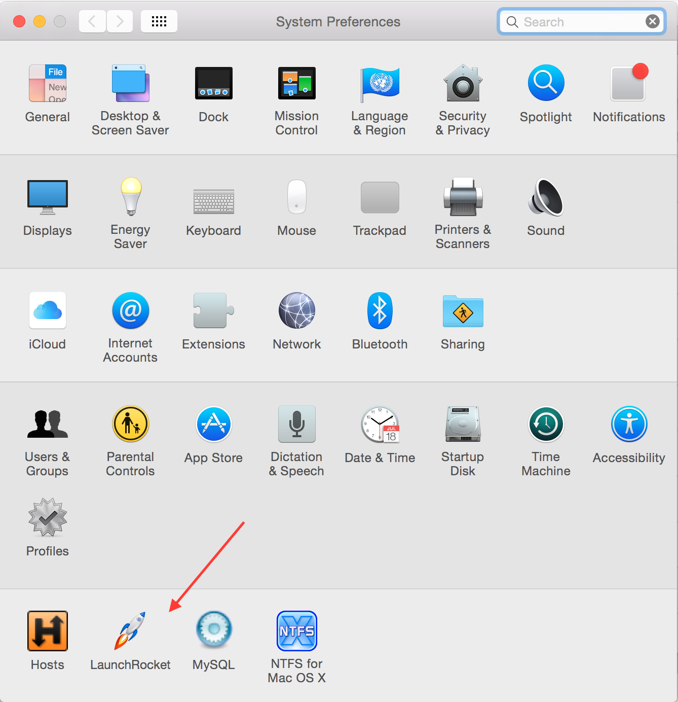

# Mac开发配置手册

《Mac开发配置手册》如何让一部全新的MacBook快速完成开发环境配置。


## 目录

* [Mac开发前需做的系统设置](#Mac开发前需做的系统设置)
* [必装软件清单](#必装软件清单)
* [brew](#brew)
* [iTerm2](#iTerm2)
  * [iTerm2常用快捷命令](#iTerm2常用快捷命令)
* [ohmyzsh](#ohmyzsh)
  * [编辑zshrc文件](#编辑zshrc文件)
  * [安装配色方案](#安装配色方案)
  * [安装代码高亮插件](#安装代码高亮插件)
  * [安装自动提示命令插件](#安装自动提示命令插件)
  * [给iTerm2中ls配色](#给iTerm2中ls配色)
  * [终端神器一键配置](#终端神器一键配置)
* [vim](#vim)
  * [进入vim界面](#进入vim界面)
  * [vim三种模式](#vim三种模式)
  * [一般模式快捷命令](#一般模式快捷命令)
  * [编辑模式快捷命令](#编辑模式快捷命令)
  * [命令行模式快捷命令](#命令行模式快捷命令)
  * [常用快捷命令命令示意图](#常用快捷命令命令示意图)
  * [其它命令](#其它命令)
  * [vim的警告信息](#vim的警告信息)
  * [vim环境设置与记录](#vim环境设置与记录)
* [git](#git)
* [Sudo免密码设置](#Sudo免密码设置)
* [临时上传下载文件](#临时上传下载文件)
* [About](#About)
* [License](#License)

## Mac开发前需做的系统设置

### 系统设置

在任何的操作系统中，首先你需要做一件事就是更新系统，点击窗口左上角的  > 关于本机 > 软件更新。
此外，如果这是一部新的电脑，你还需要到系统设置进行一些适当调整。如何调整，取决于个人喜好。

* 触控板(系统设置 > 触控板)
  * [ ] 光标与点击
  * [x] 轻拍来点按
  * [x] 辅助点按
  * [x] 查找
  * [x] 三指拖移
  * [ ] 滚动缩放
  * [x] 默认全选
  * [ ] 更多手势
  * [x] 默认全选
* Dock
  * 置于屏幕上的位置：底部
  * 设置Dock图标更小(大小随个人喜好)
  * ✓ 自动显示和隐藏Dock
* Finder
  * Finder > 显示
  * Finder > 偏好设置
    * 通用:开启新Finder窗口时打开:HOME「用户名」目录
    * 边栏:添加HOME用户名」目录和创建代码文件目录,将共享的(shared)和标记(tags)目录去掉
* 菜单栏
  * 去掉蓝牙等无需经常使用的图标
  * 将电池显示设置为百分比

* Spotlight
  * 去掉字体和书签与历史记录等不需要的内容
  * 设置合适的快捷键

* 互联网帐户
  * 添加iCloud用户，同步日历，联系人和 Find my mac 等等。
  

## 必装软件清单

### 开发工具

|软件|描述|使用|
|:-----|:-----|:-----|
|[brew](https://brew.sh/)| ||
|[iTerm2](https://iterm2.com/)| ||
|[ohmyzsh](https://ohmyz.sh/)| ||
|[git]| |`brew install git`|
|[redis]| |`brew install redis`|
|[nginx]| |`brew install nginx` 如果安装docker环境可不装|
|[sequelpro](http://sequelpro.com/)|数据库管理工具| |
|[SwitchHosts](https://github.com/oldj/SwitchHosts)|Hosts管理工具| |
|[Google Chrome](https://google.com/intl/en/chrome/)| |`brew cask install google-chrome`|
|[Sketch](https://www.sketch.com/)| ||
|[Dash](https://kapeli.com/dash)| ||
|[Parallels](https://www.parallels.com/hk)| |
|[Github](https://desktop.github.com/)| ||

### 生产力工具

|软件|描述|使用|
|:-----|:-----|:-----|
|[The Unarchiver](https://theunarchiver.com/)|支持多种格式(包括Windows下的格式)的压缩/解压缩工具||
|[1Password](https://blog.1password.com/accel-partnership/)|跨平台的密码管理工具||
|[Alfred 2](https://www.alfredapp.com/)|搜索工具||
|[AppCleaner](http://freemacsoft.net/appcleaner/)|应用程序卸载工具||
|[Dropbox](https://www.dropbox.com/)|文件同步工具||
|[Reeder](https://reederapp.com/)|RSS阅读工具||
|[Pocket](https://getpocket.com/)|稍后阅读工具||
|[Spectacle](https://www.spectacleapp.com/)|让窗口成比例的显示,在写代码调试的时候很方便||
|[OminiFocus](https://www.omnigroup.com/omnifocus)|时间管理工具||
|[Mou](http://25.io/mou/)|Markdown编辑器,国人出品||

### 其它工具

|软件|版本|说明|
|:-----|:-----|:-----|
|[CheatSheet](http://www.grandtotal.biz/cheatsheet/)|长按Command,将能查看当前程序的快捷键||


## brew

Homebrew:包管理工具可以让你安装和更新程序变得更方便，是目前在OS X系统中最受欢迎的包管理工具。
类似于centos下的yum，可以很方便地进行安装/卸载/更新各种软件包。

### 安装

`/usr/bin/ruby -e "$(curl -fsSL https://raw.githubusercontent.com/Homebrew/install/master/install)"`

#### 安装并更改源

在Mac上安装brew时，如果使用官方推荐的方式，会耗费很长时间，并且也不一定能成功。

将安装源换成国内源

* 将brew的install文件下载本地

  `curl -fsSL https://raw.githubusercontent.com/Homebrew/install/master/install >> brew_install`
  
* 修改install文件的镜像源

  `vim brew_install`
  
* 将brew_install文件里面的两行代码替换掉

  待替换的代码为：
  
  ```
  BREW_REPO = "https://github.com/Homebrew/brew".freeze
  CORE_TAP_REPO = "https://github.com/Homebrew/homebrew-core".freeze
  ```
  
  替换为：
  
  ```
  BREW_REPO = "git://mirrors.ustc.edu.cn/brew.git".freeze
  CORE_TAP_REPO = "git://mirrors.ustc.edu.cn/homebrew-core.git".freeze
  ```
  
  修改完成之后保存好修改后的brew_install文件。
  
* 安装

  `/usr/local/bin/ruby ~/brew_install`

### 基本使用

* `brew update`:更新Homebrew在服务器端上的包目录
* `brew install <package_name>`:安装
* `brew upgrade <package_name>`:更新
* `brew remove`:卸载
* `brew outdated`:查看你的包是否需要更新
* `brew cleanup`:Homebrew将会把老版本的包缓存下来，以便当你想回滚至旧版本时使用。但这是比较少使用的情况，当你想清理旧版本的包缓存时，可以运行。
* `brew list`:列出当前安装的软件
* `brew list --versions`:列出当前安装的软件(包括版本号)
* `brew search <package_name>`:查询与`package_name`相关的可用软件
* `brew info <package_name>`:查询`package_name`的安装信息

### Cask

你已经感受到了使用 Homebrew 安装命令行程序的便利。
那么接下来，我们将通过Homebrew Cask优雅、简单、快速的安装和管理OS X图形界面程序，比如Google Chrome和Dropbox。

安装Homebrew-cask是如此的简单直接，运行以下命令即可完成：

```
// 添加Github上的caskroom/cask库
brew tap caskroom/cask  
// 安装brew-cask
brew install brew-cask  
// 安装Google浏览器
brew cask install google-chrome 
// 更新
brew update && brew upgrade brew-cask && brew cleanup
```

如果你想查看cask上是否存在你需要的app，可以到[caskroom.io](https://buyinstagramlikes.io/caskroom/)进行搜索。

**文件预览插件**

有些插件可以让Mac上的文件预览更有效，比如语法高亮、markdown 渲染、json 预览等等。

```
brew cask install qlcolorcode
brew cask install qlstephen
brew cask install qlmarkdown
brew cask install quicklook-json
brew cask install qlprettypatch
brew cask install quicklook-csv
brew cask install betterzipql
brew cask install webp-quicklook
brew cask install suspicious-package  
```

OS X图形界面程序

```
brew cask install alfred
brew cask install appcleaner
brew cask install cheatsheet
brew cask install dropbox
brew cask install google-chrome
brew cask install onepassword
brew cask install sublime-text
brew cask install totalfinder
```

> 如果你经常使用Alfred启动程序，那么你会想Alfred可以搜索brew cask安装的程序，实现这些仅需运行：

```
brew cask alfred link
```

此外你还可以通过brew cask安装[launchrocket](https://github.com/jimbojsb/launchrocket)，来管理通过brew安装的service。




## iTerm2

作为一名开发者，我们常常花上很多时间在终端上，如同武士的剑，一出手便知高低。所以让我们安装Mac上最强大的终端iTerm2吧！

* 在`Keys -> Hotkey`中设置`command + option + i`快速显示和隐藏iTerm
* 在`Profiles -> Default -> Check silence bell`
* 下载`Solarized dark iterm colors`，在`Profiles -> Default -> Colors -> Load Presets`将其导入，作为默认颜色。
* 在`Profiles -> Text`改变游标(cursor)文字和颜色，随个人喜好。

### iTerm2常用快捷命令

|命令|说明|
|:-----|:-----|
|`command + t`|新建标签|
|`command + w`|关闭标签|
|`command + 数字` `command + 左右方向键`|切换标签|
|`command + d`|垂直分屏|
|`command + shift + d`|水平分屏|
|`command + shift + h`|查看剪贴板历史|
|`ctrl + u`|清除当前行|
|`ctrl + w`|删除光标之前的单词|
|`ctrl + k`|删除到文本末尾|


## ohmyzsh

安装zsh，zsh的功能极其强大，只是配置过于复杂,通过oh-my-zsh可以很快配置zsh。其中Env.sh文件用于维护别名(aliases)，输出(exports)和路径改变(path changes)等等，以免影响`~/.zshrc`。

使用brew完成zsh和zsh completions的安装:`brew install zsh zsh-completions`

> Mac系统默认使用dash作为终端，可以使用命令修改默认使用zsh:

```
chsh -s /bin/zsh
```

如果想修改回默认dash，同样使用chsh命令即可：

```
chsh -s /bin/bash
```

> 查看系统当前使用的shell:`echo $SHELL`

> 查看系统是否安装了zsh:`cat /etc/shells`

安装oh-my-zsh方法有两种，可以使用curl或wget，看自己环境或喜好：

```
# curl 安装方式
sh -c "$(curl -fsSL https://raw.github.com/robbyrussell/oh-my-zsh/master/tools/install.sh)"
```

```
# wget 安装方式
sh -c "$(wget https://raw.githubusercontent.com/robbyrussell/oh-my-zsh/master/tools/install.sh -O -)"
```

卸载oh-my-zsh，在命令行输入如下命令，回车即可:`uninstall_oh_my_zsh`

### 编辑zshrc文件

```
# 设置主题
ZSH_THEME="agnoster"

# 设置别名
alias zshconfig="vim ~/.zshrc"
alias envconfig="vim ~/.env"
alias ohmyzsh="vim ~/.oh-my-zsh"  

# 隐藏用户名和主机名(user@hostname)
prompt_context() {}
```

oh-my-zsh主题列表:https://github.com/robbyrussell/oh-my-zsh/wiki/themes

> 注意：许多主题需要安装[Powerline Fonts](https://github.com/powerline/fonts)才能正确呈现。

```
# clone
git clone https://github.com/powerline/fonts.git --depth=1
# install
cd fonts
./install.sh
# clean-up a bit
cd ..
rm -rf fonts
```

安装好字体库之后，我们来设置iTerm2的字体，具体的操作是:
打开`iTerm2 -> Preferences -> Profiles -> Text`,在Font区域选中`Change Font`，然后找到Meslo字体。有L、M、S可选，看个人喜好：

### 安装配色方案

```
cd ~/.oh-my-zsh/custom/plugins
git clone https://github.com/altercation/solarized
cd solarized/iterm2-colors-solarized/
open .
```

在打开的finder窗口中，双击`Solarized Dark.itermcolors`和`Solarized Light.itermcolors`即可安装明暗两种配色：

打开`iTerm2 -> Preferences -> Profiles -> Colors -> Color Presets`中根据个人喜好选择。

### 安装代码高亮插件

```
cd ~/.oh-my-zsh/custom/plugins
git clone https://github.com/zsh-users/zsh-syntax-highlighting.git
vim ~/.zshrc
```

这时我们再次打开zshrc文件进行编辑。找到plugins，此时plugins中应该已经有了git，我们需要把高亮插件也加上：

```
plugins=(git zsh-syntax-highlighting)
```

> 请务必保证插件顺序，`zsh-syntax-highlighting`必须在最后一个。

执行命令使刚才的修改生效:`source ~/.zshrc`

### 安装自动提示命令插件

跟代码高亮的安装方式一样，这也是一个zsh的插件，叫做`zsh-autosuggestion`，用于命令建议和补全。

```
cd ~/.oh-my-zsh/custom/plugins/
git clone https://github.com/zsh-users/zsh-autosuggestions
vim ~/.zshrc
```

同上找到plugins，把自动提示命令插件加上：

```
plugins=(git zsh-autosuggestions zsh-syntax-highlighting)
```

执行命令使刚才的修改生效:`source ~/.zshrc`

> 推荐一张背景图:`http://wx1.sinaimg.cn/large/81f8a509gy1fnjdvkkwgoj20zk0m8ak8.jpg`


### 终端神器一键配置


## vim

所有的 UNIX Like 系统度会内置vi文本编辑器，其他的文本编辑器则不一定会存在。

### 进入vim界面

* `vim filename` 打开或新建文件，并将光标置于第一行首
* `vim +n filename` 打开文件，并将光标置于第n行首
* `vim + filename` 打开文件，并将光标置于最后一行首
* `vim +/pattern filename` 打开文件，并将光标置于第一个与pattern匹配的串处
* `vim -r filename` 在上次正用vi编辑时发生系统崩溃，恢复filename
* `vim filename....filename` 打开多个文件，依次进行编辑

### vim三种模式

* 一般模式:以vim打开一个文件就直接进入一般模式(默认的模式)。可以上下移动光标，删除字符或删除整行，也可以复制、粘贴你的文件数据，但无法编辑文件内容。
* 编辑模式:按下`i,I,o,O,a，A,r,R`等任一个字母之后才会进入编辑模式，界面的左下方会出现`INSERT`或`REPLACE`的字样。再按下`Esc`按键即可退出编辑模式，回到一般模式。
* 命令行模式:输入`: / ?`3个中的任一个按钮，就可以将光标移动到最下面那一行。此模式中，可以提供你的查找数据的操作，而读取、保存大量替换字符、离开vim、显示行号等的操作则是在此模式中完成的。
 
### 一般模式快捷命令

* 光标移动

  * `h` 或 `←` 或 `Backspace` 光标左移一个字符
  * `l` 或 `→` 或 `space` 光标右移一个字符，向后面移动20个字符距离，可以使用`20`+`l`或`→`或`space`的组合按键。
  * `k` 或 `↑` 或 `Ctrl+p` 光标上移一行
  * `j` 或 `↓` 或 `Ctrl+n` 光标下移一行，向下移动30行，可以使用`30`+`j`或`↓`或`trl+n`的组合按键。
  * `Home` 或 `0` 移动到这一行的最前面字符处
  * `End` 或 `$` 移动到这一行的最后面字符处
  * `gg` 或 `H` 移动到这个文件的第一行，想要移动到这个文件的第20行，使用`20gg`组合按键
  * `G` 或 `L` 移动到这个文件的最后一行，想要移动到这个文件的第20行，可以`20G`组合按键。
  * `M` 移动到屏幕的中间行。
  * `n[Enter]` n为数字。光标向下移动n行。
  
* 搜索(查找)

  * `/abc` 从光标开始处向文件尾搜索abc
  * `?abc` 从光标开始处向文件首搜索abc
  * `/\/abc` 从光标开始处向文件尾搜索/abc，其中/是转义
  * `n` 向下继续查找上一次搜索的内容
  * `N` 向上继续查找上一次搜索的内容

* 替换

  命令：`:[range]s/from/to/[c,e,g,i]`
  * `[range]s` 指的是范围
    * 不写range,则默认为光标所在行
    * . 表示当前行
    * $ 表示最后一行
    * % 表示所有行
    * 5 表示第五行
    * 1,7 从第一行至第七行
    * .+1 表示当前行的下一行
    * $-1 表示倒数第二行
  * `pattern` 就是要被替换掉的字串，可以用 regexp 来表示
  * `string` 将 pattern 由 string 所取代
  * `[c,e,g,i]` 
    * 无:表示只替换范围内的第一个
    * c 替换前进行询问
    * e 忽略执行过程中的错误
    * g 对指定范围内的所有项进行替换
    * i 不分大小写

  > 例如：在100到200行之间查找abc并替换为ABC则用：`:100,200s/abc/ABC/g`。

  基本使用
  * `:s/abc/ABC/` 替换当前行第一个 abc 为 ABC。
  * `:s/abc/ABC/g` 替换当前行所有 abc 为 ABC。
  * `:n,$s/abc/ABC/` 替换第n行开始到最后一行中每一行的第一个abc为ABC。
  * `:n,$s/abc/ABC/g` 替换第n行开始到最后一行中每一行所有abc为ABC。
  * `:%s/abc/ABC/` 替换每一行的第一个abc为ABC。
  * `:%s/abc/ABC/g` 替换每一行中所有abc为ABC。
  
  > 可以使用`#`或`+`作为分隔符，此时出现的`/`不会作为分隔符。如:`:s#abc/#ABC/#`替换当前行第一个`abc/`为`ABC/`。
  
* 删除

  * `x` 在一行字当中，向后删除一个字符(相当于[Del]按键)。
  * `X` 在一行字当中，向前删除一个字符(相当于[Backspace]按键)。
  * `dd` 删除光标所在的那一整行。
  * `ndd` 删除光标所在的向下n行，例如20dd则是删除20行。
  * `d1G` 删除从光标所在到第一行的所有数据。
  * `dG` 删除从光标所在到最后一行的所有数据。
  * `d0` 删除从光标所在到该行的最前面第一个字符。
  * `d$` 删除从光标所在到该行的最后一个字符。

* 复制

  * `yy` 复制光标所在的那一行。
  * `nyy` 复制光标所在的向下n行，例如20yy则是复制20行。
  * `y1G` 复制从光标所在到第一行的所有数据。
  * `yG` 复制从光标所在到最后一行的所有数据。
  * `y0` 复制从光标所在到该行的最前面第一个字符的所有数据。
  * `y$` 复制从光标所在到该行的最后一个字符的所有数据。

*  粘贴

    * `p` 将已经复制的数据在光标下一行粘贴。
    * `P` 将已经复制的数据在光标上一行粘贴。

* 其它

  * `J` 将光标所在行与下一行的数据结合成一行。
  * `u` 撤销
  * `Ctrl + r` 恢复撤销，与`u`相反
  * `.` 重复前一个操作

### 编辑模式快捷命令

* i：在当前光标所在字符的前面，转为输入模式。
* I：在当前光标所在行的行首转换为输入模式。
* a：在当前光标所在字符的后面，转为输入模式。
* A：在光标所在行的行尾，转换为输入模式。
* o：在当前光标所在行的下方，新建一行，并转为输入模式。
* O：在当前光标所在行的上方，新建一行，并转为输入模式。
* r：替换光标处所在字符一次。
* R：一直替换光标所在的文字，直到按下[ESC]键为止。

### 命令行模式快捷命令

* `:w` 将编辑的数据写入硬盘。
* `:w!` 若文件属性为"只读"时，强制写入该文件。
* `:q` 退出vi。
* `:q!` 若曾修改过文件，又不想存储，使用!为强制离开不保存文件。
* `:wq` 保存退出vi。
* `:wq!` 强制保存后退出vi。
* `:w filename` 另存为filename。
* `:n1,n2w filename` 将n1-n2行之间的内存另存为filename。
* `!comad` 暂时离开vi到命令行模式下执行comad的显示结果。

### 常用快捷命令命令示意图


### 其它命令

* 多文件编辑 `vim a.txt b.txt`
  * `:n` 编辑下一个文件
  * `:N` 编辑上一个文件
  * `:files` 列出目前这个vim打开的所有文件
* 多窗口功能
  `:sp`

### vim的警告信息

```
E325: ATTENTION # 错误代码
Found a swap file by the name ".test.html.swp" # 下面的行数说明暂存文件的存在
          owned by: march   dated: Tue Nov 26 14:27:07 2019
         file name: ~march/test.html # 这个暂存属于哪个实际文件？
          modified: YES
         user name: march   host name: mao
        process ID: 7624
While opening file "test.html"
             dated: Mon Nov 25 19:10:03 2019

# 下面说明可能发生这个错误的两个主要原因与解决方案
(1) Another program may be editing the same file.  If this is the case,
    be careful not to end up with two different instances of the same
    file when making changes.  Quit, or continue with caution.
(2) An edit session for this file crashed.
    If this is the case, use ":recover" or "vim -r test.html"
    to recover the changes (see ":help recovery").
    If you did this already, delete the swap file ".test.html.swp"
    to avoid this message.

# 下面说明你可进行的动作
Swap file ".test.html.swp" already exists!
[O]pen Read-Only, (E)dit anyway, (R)ecover, (D)elete it, (Q)uit, (A)bort:
```

由于暂存文件存在的关系，因此vim会主动的判断你的这个文件可能有些问题，在上面中vim提示两点主要的问题与解决方案，分别是这样的：

* 问题一：可能有其他人或程序同时在编辑这个文件。

  由于Linux是多用户多任务的环境，因此很可能有很多人同时在编辑同一个文件。如果在多人共同编辑的情况下，万一大家同时储存，
  那么这个文件的内容将会变的乱七八糟！为了避免这个问题，因此vim会出现这个警告窗口！解决的方法则是：
  
  * 找到另外那个程序或人员，请他将该vim的工作结束，然后你再继续处理。
  * 如果你只是要看该文件的内容并不会有任何修改的行为，那么可以选择打开成为只读`O`文件，其实就是[O]pen Read-Only的选项啦！
  
* 问题二：在前一个vim的环境中，可能因为某些不知名原因导致vim中断(crashed)。

  这就是常见的不正常结束vim产生的后果。解决方案依据不同的情况而不同！处理方法为：
  
  * 如果你之前的vim处理动作尚未储存，此时你应该要按下“R”，亦可使用(R)ecover的项目，此时vim会载入`.test.html.swp`的内容，
  让你自己来决定要不要储存！这样就能够救回之前未储存的工作。不过那个`.test.html.swp`并不会在你结束vim后自动删除，
  所以你离开vim后还得要自行删除,才能避免每次找开这个文件都会出现这样的警告！
  
  * 如果你确定这个暂存文件是没有用的，那么你可以直接按下`D`，删除掉这个暂存文件，即(D)elete it这个项目。此时vim会载入`.test.html`，
  并且将旧的`.test.html.swp`删除后，创建这次会使用的新的`.test.html.swp`！
  
至于这个发现暂存盘警告信息的画面中，有出现六个可用按键，各按钮的说明如下：

* `[O]pen Read-Only` 打开此文件成为只读文件，可以用在你只是想要查阅文件内容并不想要进行编辑行为时。
一般来说，如要你是登录到别人的计算机去看他的配置文件，结果发现他自己在编辑时，可以使用这个模式。
* `(E)dit anyway` 还是用正常的方式打开你要编辑的那个文件，并不会载入暂存文件的内容。
不过很容易出现两个使用者互相改变对方的文件等问题！不好不好！
* `(R)ecover`  就是载入暂存文件的内容，用在你要救回之前未储存的工作。不过当你救回来并且储存离开vim后，
还是要手动自行删除那个暂存文件喔！
* `(D)elete it` 你确定那个暂存文件是无用的！那么打开文件前会先将这个暂存文件删除！这个动作其实是比较常做的！
因为你可能不确定这个暂存文件是怎么来的，所以就删除掉他吧。
* `(Q)uit` 离开vim编辑界面。
* `(A)bort` 离开vim编辑界面，与quit非常类似。

### vim环境设置与记录

`~/.vimrc`:配置文件，`~/.viminfo`:记录文件。


## git

作为一名开发者怎么可能没有Git呢? 我们马上就来安装：

```
brew install git
```

好的，现在我们来测试一下Git是否安装完好：

```
git --version
```

接着，我们将定义你的Git帐号(与你在GitHub使用的用户名和邮箱一致)

```
git config --global user.name "Your Name Here"
git config --global user.email "your_email@youremail.com"  
```

这些配置信息将会添加进`~/.gitconfig`文件中。

推荐使用HTTPS方法(另一个是SSH)，将你的代码推送到Github上的仓库。
如果你不想每次都输入用户名和密码的话，可以按照此[描述](https://help.github.com/en/github/getting-started-with-github/set-up-git)说的那样，运行：

```
git config --global credential.helper osxkeychain
```

此外，如果你打算使用 SSH 方式，可以参考此[链接](https://help.github.com/en/github/authenticating-to-github/connecting-to-github-with-ssh).


## Sudo免密码设置

* 打开命令窗口输入如下命令：`sudo visudo`
* 替换 #%username ALL=(ALL) ALL 为:`%username ALL=(ALL) NOPASSWD: ALL`

> username为当前登录用户名


## 临时上传下载文件

```
curl -F "file=@test.txt" https://file.io
{"success":true,"key":"2ojE41","link":"https://file.io/2ojE41","expiry":"14 days"}

curl https://file.io/2ojE41
This is a test

curl https://file.io/2ojE41
{"success":false,"error":404,"message":"Not Found"}
```

设置到期时间

```
curl -F "file=@test.txt" https://file.io/?expires=1w
{"success":true,"key":"aQbnDJ","link":"https://file.io/aQbnDJ","expiry":"7 days"}

sleep 604801

curl https://file.io/aQbnDJ
{"success":false,"error":404,"message":"Not Found"}
```

> 查询参数过期必须是一个正整数，默认情况下，它表示删除文件之前的天数（默认为14天）。如果跟随w，则为周数。m代表数月，y代表数年。

还可以将直接文本发送到`file.io`:

```
curl --data "text=this is a secret pw" https://file.io
{"success":true,"key":"pgiPc2","link":"https://file.io/pgiPc2","expiry":"14 days"}

curl https://file.io/pgiPc2
this is a secret pw

curl https://file.io/pgiPc2
{"success":false,"error":404,"message":"Not Found"}
```


## About

* **作者**：March
* **邮箱**：fengqi.mao.march@gmail.com
* **头条**：https://toutiao.io/u/425956/subjects
* **简书**：https://www.jianshu.com/u/02f2491c607d
* **掘金**：https://juejin.im/user/5b484473e51d45199940e2ae
* **CSDN**：http://blog.csdn.net/u011810138
* **SegmentFault**：https://segmentfault.com/u/maoqiqi
* **StackOverFlow**：https://stackoverflow.com/users/8223522


## License

```
   Copyright 2019 maoqiqi

   Licensed under the Apache License, Version 2.0 (the "License");
   you may not use this file except in compliance with the License.
   You may obtain a copy of the License at

       http://www.apache.org/licenses/LICENSE-2.0

   Unless required by applicable law or agreed to in writing, software
   distributed under the License is distributed on an "AS IS" BASIS,
   WITHOUT WARRANTIES OR CONDITIONS OF ANY KIND, either express or implied.
   See the License for the specific language governing permissions and
   limitations under the License.
```